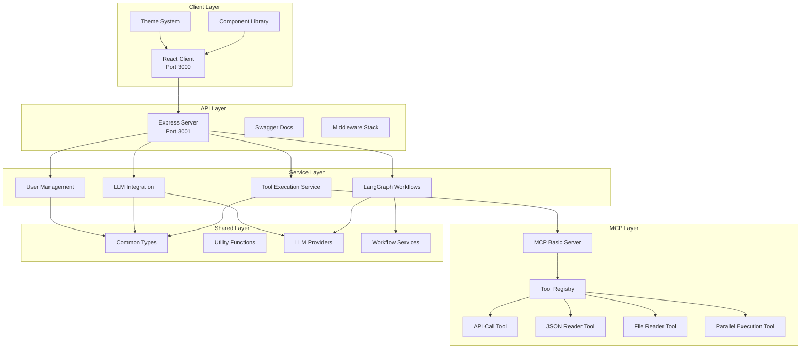

# Architecture Overview

Clear AI is built as a modern, scalable monorepo that follows microservices principles while maintaining tight integration between components. This section explains how everything fits together.

## High-Level Architecture



## Core Principles

### 1. **Separation of Concerns**
Each package has a single, well-defined responsibility:
- **Client**: User interface and user experience
- **Server**: API endpoints and business logic
- **MCP Basic**: Tool execution and protocol handling
- **Shared**: Common utilities and type definitions

### 2. **Type Safety First**
TypeScript is used throughout the entire stack, with shared types ensuring consistency:
```typescript
// Shared types used across all packages
export interface ApiResponse<T> {
  success: boolean;
  data: T;
  message: string;
}

export interface ToolExecutionRequest {
  toolName: string;
  args: Record<string, any>;
}
```

### 3. **Modular Design**
Components are designed to be:
- **Reusable**: Components can be used across different contexts
- **Testable**: Each module can be tested in isolation
- **Extensible**: New features can be added without breaking existing functionality

## Package Architecture

### Client Package (`@clear-ai/client`)

The client is a modern React application built with:

- **React 18**: Latest React features including concurrent rendering
- **TypeScript**: Full type safety
- **Vite**: Lightning-fast development and building
- **Tailwind CSS**: Utility-first styling
- **React Router**: Client-side routing
- **Axios**: HTTP client for API communication

**Key Features:**
- Theme system with 5 different themes
- Component library with Storybook documentation
- Responsive design
- Hot module replacement

### Server Package (`@clear-ai/server`)

The server provides a comprehensive API built with:

- **Express.js**: Web framework
- **TypeScript**: Type-safe server code
- **Swagger/OpenAPI**: API documentation
- **CORS & Helmet**: Security middleware
- **Morgan**: Request logging

**API Categories:**
- **Health**: System health and status
- **Tools**: Tool execution and management
- **LangGraph**: Workflow orchestration
- **MCP**: Model Context Protocol integration
- **Users**: User management

### MCP Basic Package (`@clear-ai/mcp-basic`)

Implements the Model Context Protocol with essential tools:

- **MCP SDK**: Protocol implementation
- **Tool Registry**: Dynamic tool management
- **Zod Schemas**: Runtime validation
- **JSON Schema**: Tool definitions

**Available Tools:**
- `api_call`: HTTP API requests
- `json_reader`: JSON data parsing
- `file_reader`: File system operations
- `execute_parallel`: Parallel tool execution

### Shared Package (`@clear-ai/shared`)

Contains common code used across all packages:

- **Types**: TypeScript interfaces and types
- **Utilities**: Helper functions
- **Constants**: Application constants
- **Services**: LLM providers and workflow services

## Data Flow

### 1. **User Interaction Flow**
```
User Input → Client Component → API Service → Server Endpoint → Business Logic → Tool Execution → Response
```

### 2. **Tool Execution Flow**
```
Natural Language Query → LLM Analysis → Tool Selection → Parameter Extraction → Tool Execution → Result Processing
```

### 3. **Workflow Execution Flow**
```
Workflow Definition → LangGraph Engine → Step Execution → Result Aggregation → Final Response
```

## Communication Patterns

### 1. **Client-Server Communication**
- **REST APIs**: Standard HTTP methods
- **JSON**: Data serialization
- **Axios**: HTTP client with interceptors
- **Error Handling**: Consistent error responses

### 2. **Server-MCP Communication**
- **MCP Protocol**: Standardized tool execution
- **JSON-RPC**: Request/response pattern
- **Schema Validation**: Runtime type checking

### 3. **Inter-Package Communication**
- **Shared Types**: Type-safe interfaces
- **Common Utilities**: Shared functions
- **Event System**: Loose coupling between packages

## Security Architecture

### 1. **Input Validation**
- **Zod Schemas**: Runtime validation
- **TypeScript**: Compile-time checking
- **Sanitization**: Input cleaning

### 2. **API Security**
- **CORS**: Cross-origin resource sharing
- **Helmet**: Security headers
- **Rate Limiting**: Request throttling
- **Authentication**: User verification (planned)

### 3. **Tool Execution Security**
- **Sandboxing**: Isolated execution environment
- **Permission System**: Tool access control
- **Audit Logging**: Execution tracking

## Scalability Considerations

### 1. **Horizontal Scaling**
- **Stateless Design**: No server-side sessions
- **Load Balancing**: Multiple server instances
- **Database Separation**: External data storage

### 2. **Performance Optimization**
- **Caching**: Response caching strategies
- **Lazy Loading**: On-demand resource loading
- **Code Splitting**: Bundle optimization

### 3. **Monitoring & Observability**
- **Logging**: Comprehensive logging
- **Metrics**: Performance monitoring
- **Tracing**: Request tracing with Langfuse

## Technology Stack

### Frontend
- React 18
- TypeScript
- Vite
- Tailwind CSS
- React Router
- Axios
- Storybook

### Backend
- Node.js
- Express.js
- TypeScript
- Swagger/OpenAPI
- LangChain
- LangGraph

### Tools & Infrastructure
- npm workspaces
- ESLint
- Prettier
- Vitest
- Playwright

## Next Steps

Now that you understand the high-level architecture:

1. **Dive Deeper**: Explore specific [packages](/docs/packages/client)
2. **Learn Development**: Check out the [development guide](/docs/getting-started/development)
3. **Understand APIs**: Browse the [API reference](/docs/api/overview)
4. **Build Something**: Follow the [tutorials](/docs/tutorials/building-your-first-tool)
