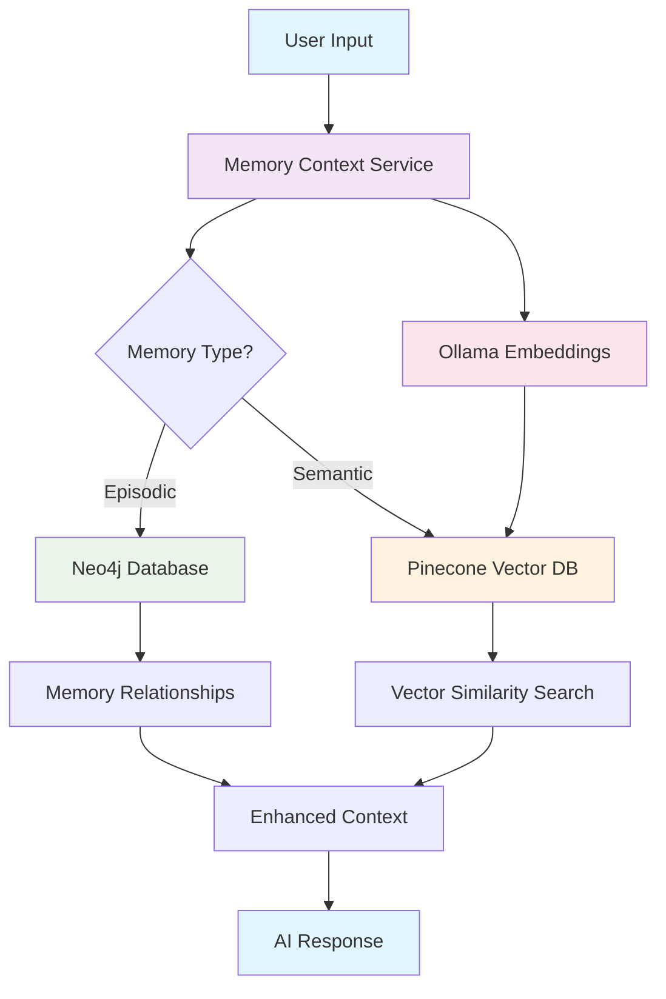

# Memory System Overview

The Clear-AI Memory System is a sophisticated, privacy-focused memory management solution designed for AI applications. It combines three powerful technologies to create a comprehensive memory ecosystem that can remember, learn, and provide context-aware responses.

## 🧠 What is the Memory System?

Think of the memory system as the "brain" of your AI application. Just like humans have different types of memory (short-term, long-term, episodic, semantic), our AI system uses different storage mechanisms to handle different types of information:

- **Episodic Memory** (Neo4j): Remembers specific events, conversations, and interactions
- **Semantic Memory** (Pinecone): Stores knowledge, concepts, and facts
- **Local Embeddings** (Ollama): Converts text into numbers for similarity search

## 🎯 Why Do We Need This?

### The Problem
Without a memory system, AI applications are like goldfish - they forget everything after each conversation. Every time a user asks a question, the AI starts from scratch, unable to:
- Remember previous conversations
- Build on past interactions
- Provide personalized responses
- Learn from user preferences
- Maintain context across sessions

### The Solution
Our memory system solves these problems by:
- **Persistent Memory**: Information survives between sessions
- **Context Awareness**: AI remembers what was discussed before
- **Personalization**: Responses improve based on user history
- **Privacy**: All processing happens locally (no external API calls for embeddings)

## 🏗️ Architecture Deep Dive



### Component Breakdown

#### 1. Memory Context Service
**What it does**: The central orchestrator that decides how to handle different types of memory
**Why it's important**: Acts as the "traffic controller" ensuring the right data goes to the right storage system

#### 2. Neo4j Database (Episodic Memory)
**What it stores**: 
- Conversation history
- User interactions
- Temporal relationships
- Session data

**Why Neo4j?**
- **Graph Structure**: Perfect for representing relationships between memories
- **Temporal Queries**: Excellent at handling time-based data
- **Flexibility**: Can easily add new relationship types
- **Performance**: Fast queries even with complex relationships

**Example Use Case**: 
```
User: "Remember that I prefer Python over JavaScript"
AI: Stores this as an episodic memory with relationships to:
- User preferences
- Programming languages
- Previous conversations about coding
```

#### 3. Pinecone Vector Database (Semantic Memory)
**What it stores**:
- Knowledge concepts
- Facts and information
- Vector embeddings of text

**Why Pinecone?**
- **Vector Similarity**: Find similar concepts even with different wording
- **Scalability**: Handles millions of vectors efficiently
- **Speed**: Sub-second search across large knowledge bases
- **Flexibility**: Easy to update and modify knowledge

**Example Use Case**:
```
User: "What's the difference between machine learning and deep learning?"
AI: Searches semantic memory for:
- "machine learning" concepts
- "deep learning" concepts
- Related AI knowledge
- Previous explanations given
```

#### 4. Ollama (Local Embeddings)
**What it does**: Converts text into numerical vectors for similarity search
**Why Local?**
- **Privacy**: No data sent to external services
- **Speed**: No network latency
- **Cost**: No API fees
- **Control**: Full control over the embedding model

## 🔄 How It All Works Together

### Step 1: User Input
```typescript
const userInput = "I'm working on a React project and need help with state management";
```

### Step 2: Memory Enhancement
The system:
1. **Searches episodic memory** for previous React discussions
2. **Searches semantic memory** for React state management knowledge
3. **Retrieves related memories** about the user's coding preferences
4. **Builds enhanced context** with relevant information

### Step 3: Context Building
```typescript
const enhancedContext = {
  userPreferences: "Prefers functional components over class components",
  previousDiscussions: ["Discussed Redux vs Context API last week"],
  relevantKnowledge: ["React hooks", "State management patterns", "Performance optimization"],
  currentProject: "React application with complex state"
};
```

### Step 4: AI Response
The AI now has rich context to provide a personalized, informed response.

## 📊 Memory Types Explained

### Episodic Memory (Neo4j)
**Think of it as**: Your personal diary of interactions

**Stores**:
- "User asked about React hooks on 2024-01-15"
- "User prefers TypeScript over JavaScript"
- "User mentioned working on a e-commerce project"

**Structure**:
```cypher
(:User)-[:HAS_MEMORY]->(:EpisodicMemory {
  content: "User asked about React hooks",
  timestamp: "2024-01-15T10:30:00Z",
  importance: 0.8,
  tags: ["React", "hooks", "frontend"]
})
```

### Semantic Memory (Pinecone)
**Think of it as**: Your knowledge encyclopedia

**Stores**:
- "React hooks are functions that let you use state and lifecycle features"
- "useState is a hook for managing component state"
- "Custom hooks allow you to extract component logic"

**Structure**:
```json
{
  "id": "react-hooks-knowledge",
  "vector": [0.1, 0.3, 0.7, ...], // 768-dimensional vector
  "metadata": {
    "concept": "React hooks",
    "description": "Functions for state and lifecycle",
    "category": "frontend",
    "confidence": 0.9
  }
}
```

## 🚀 Real-World Scenarios

### Scenario 1: Learning Assistant
**Situation**: User is learning web development
**Memory System Role**:
- Remembers what topics they've covered
- Tracks their progress and understanding
- Suggests next learning steps based on gaps
- Provides personalized explanations

### Scenario 2: Code Review Assistant
**Situation**: User submits code for review
**Memory System Role**:
- Remembers previous code patterns they've used
- Knows their coding style preferences
- References past feedback and improvements
- Provides consistent, personalized feedback

### Scenario 3: Project Management
**Situation**: User is working on multiple projects
**Memory System Role**:
- Tracks project-specific context
- Remembers decisions and rationale
- Maintains separate knowledge bases per project
- Provides project-aware assistance

## 🔧 Technical Benefits

### For Developers
- **Type Safety**: Full TypeScript support
- **Easy Integration**: Simple REST API
- **Flexible**: Easy to extend and customize
- **Well Documented**: Comprehensive guides and examples

### For Users
- **Personalized**: Responses improve over time
- **Contextual**: AI remembers conversation history
- **Efficient**: No need to repeat information
- **Private**: Data stays on your infrastructure

### For Organizations
- **Scalable**: Handles growing data and users
- **Maintainable**: Clear separation of concerns
- **Cost-Effective**: Local processing reduces API costs
- **Compliant**: Full control over data storage and processing

## 🎯 Next Steps

Now that you understand the overview, explore these detailed guides:

1. **[Neo4j Integration Guide](./neo4j-integration.md)** - Deep dive into episodic memory
2. **[Pinecone Vector Database](./pinecone-vectors.md)** - Understanding semantic memory
3. **[Ollama Setup Guide](./ollama-embeddings.md)** - Local embedding configuration
4. **[Practical Examples](./memory-examples.md)** - Real-world usage scenarios
5. **[Troubleshooting Guide](./memory-troubleshooting.md)** - Common issues and solutions

## 🤔 Common Questions

**Q: Why not just use a regular database?**
A: Regular databases are great for structured data, but they struggle with:
- Finding similar concepts (vector similarity)
- Representing complex relationships (graph structures)
- Handling temporal sequences (time-based queries)

**Q: Is this system overkill for simple applications?**
A: Not at all! The system is designed to scale from simple to complex. You can start with basic memory storage and add advanced features as needed.

**Q: How does this compare to external AI services?**
A: Our system gives you:
- Complete control over your data
- No external API dependencies
- Customizable memory strategies
- Cost predictability

**Q: What if I don't need both Neo4j and Pinecone?**
A: The system is modular - you can use just episodic memory (Neo4j) or just semantic memory (Pinecone) based on your needs.

---

*Ready to dive deeper? Check out the [Neo4j Integration Guide](./neo4j-integration.md) to learn how episodic memory works!*
