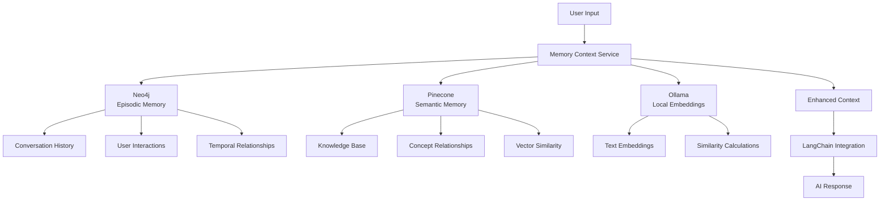

# Memory System

The Clear-AI Memory System provides intelligent memory management for AI applications, enabling persistent context, knowledge storage, and memory-aware conversations.

## Overview

The Memory System combines two types of memory to create a comprehensive knowledge management solution:

- **Episodic Memory** (Neo4j): Stores conversation history, user interactions, and temporal relationships
- **Semantic Memory** (Pinecone): Stores knowledge, concepts, and facts as vector embeddings
- **Local Embeddings** (Ollama): Privacy-focused text embeddings using local models

## Key Features

### 🧠 Intelligent Memory Storage
- **Episodic Memory**: Track conversations, user interactions, and temporal sequences
- **Semantic Memory**: Store and retrieve knowledge using vector similarity
- **Relationship Mapping**: Connect related memories and concepts
- **Importance Scoring**: Prioritize memories based on relevance and importance

### 🔍 Advanced Search Capabilities
- **Vector Similarity Search**: Find semantically similar content
- **Temporal Filtering**: Search by time ranges and sequences
- **Tag-based Organization**: Organize memories with custom tags
- **Context Enhancement**: Retrieve relevant memories for better responses

### 🔒 Privacy-Focused Design
- **Local Embeddings**: No data sent to external services for embeddings
- **User Isolation**: Memories are user-specific and isolated
- **Encrypted Storage**: Secure storage with Neo4j encryption
- **Configurable Cleanup**: Automatic cleanup of old memories

### 🚀 Easy Integration
- **REST API**: Simple HTTP endpoints for all operations
- **TypeScript Support**: Full type definitions and interfaces
- **LangChain Integration**: Seamless integration with existing workflows
- **Chat Interface**: Ready-to-use conversational APIs

## Architecture



## Memory Types

### Episodic Memory

Episodic memory stores temporal sequences of events, conversations, and user interactions.

**Features:**
- Conversation history tracking
- User interaction logging
- Temporal relationship mapping
- Importance scoring
- Tag-based organization

**Use Cases:**
- Chat history and context
- User behavior tracking
- Conversation flow analysis
- Personalization data

**Example:**
```typescript
const episodicMemory = {
  id: "memory-123",
  userId: "user123",
  sessionId: "session456",
  timestamp: new Date(),
  content: "User asked about machine learning algorithms",
  context: {
    conversation_turn: 1,
    topic: "AI"
  },
  metadata: {
    source: "chat",
    importance: 0.8,
    tags: ["AI", "machine learning"],
    location: "web_interface"
  },
  relationships: {
    previous: "memory-122",
    next: "memory-124",
    related: ["memory-125", "memory-126"]
  }
};
```

### Semantic Memory

Semantic memory stores knowledge, concepts, and facts as vector embeddings.

**Features:**
- Vector similarity search
- Concept relationship mapping
- Confidence scoring
- Category organization
- Access tracking

**Use Cases:**
- Knowledge base management
- Concept understanding
- Fact retrieval
- Learning systems

**Example:**
```typescript
const semanticMemory = {
  id: "concept-123",
  userId: "user123",
  concept: "Machine Learning",
  description: "A subset of artificial intelligence that focuses on algorithms that can learn from data",
  metadata: {
    category: "AI",
    confidence: 0.9,
    source: "wikipedia",
    lastAccessed: new Date(),
    accessCount: 5
  },
  relationships: {
    similar: ["concept-456", "concept-789"],
    parent: "concept-101",
    children: ["concept-202", "concept-303"]
  }
};
```

## API Endpoints

### Memory Management

| Endpoint | Method | Description |
|----------|--------|-------------|
| `/api/memory/episodic` | POST | Store episodic memory |
| `/api/memory/episodic/:id` | GET | Get episodic memory |
| `/api/memory/episodic/search` | POST | Search episodic memories |
| `/api/memory/episodic/:id` | PUT | Update episodic memory |
| `/api/memory/episodic/:id` | DELETE | Delete episodic memory |
| `/api/memory/semantic` | POST | Store semantic memory |
| `/api/memory/semantic/:id` | GET | Get semantic memory |
| `/api/memory/semantic/search` | POST | Search semantic memories |
| `/api/memory/semantic/:id` | PUT | Update semantic memory |
| `/api/memory/semantic/:id` | DELETE | Delete semantic memory |

### Chat Integration

| Endpoint | Method | Description |
|----------|--------|-------------|
| `/api/memory-chat/initialize` | POST | Initialize memory service |
| `/api/memory-chat/chat` | POST | Chat with memory context |
| `/api/memory-chat/history/:userId/:sessionId` | GET | Get chat history |
| `/api/memory-chat/search` | POST | Search during chat |
| `/api/memory-chat/knowledge` | POST | Store knowledge |
| `/api/memory-chat/knowledge/search` | POST | Search knowledge |

### Context and Utilities

| Endpoint | Method | Description |
|----------|--------|-------------|
| `/api/memory/context/:userId/:sessionId` | GET | Get memory context |
| `/api/memory/search` | POST | Search all memories |
| `/api/memory/stats/:userId` | GET | Get memory statistics |
| `/api/memory/clear/:userId` | DELETE | Clear user memories |
| `/api/memory/related/:memoryId` | GET | Get related memories |

## Configuration

### Environment Variables

```env
# Neo4j Configuration
NEO4J_URI=bolt://localhost:7687
NEO4J_USERNAME=neo4j
NEO4J_PASSWORD=your_password
NEO4J_DATABASE=your_database

# Pinecone Configuration (optional)
PINECONE_API_KEY=your_pinecone_api_key
PINECONE_ENVIRONMENT=your_environment
PINECONE_INDEX_NAME=clear-ai-memories

# Memory System Settings
MEMORY_EMBEDDING_MODEL=nomic-embed-text
MEMORY_EMBEDDING_DIMENSIONS=768
MEMORY_MAX_CONTEXT_MEMORIES=50
MEMORY_SIMILARITY_THRESHOLD=0.7
OLLAMA_BASE_URL=http://localhost:11434
```

### Service Configuration

```typescript
const memoryConfig = {
  neo4j: {
    uri: 'bolt://localhost:7687',
    username: 'neo4j',
    password: 'password',
    database: 'neo4j'
  },
  pinecone: {
    apiKey: 'your_pinecone_api_key',
    environment: 'your_environment',
    indexName: 'clear-ai-memories'
  },
  embedding: {
    model: 'nomic-embed-text',
    dimensions: 768
  }
};
```

## Usage Examples

### Basic Memory Storage

```typescript
import { MemoryContextService } from '@clear-ai/shared';

// Initialize service
const memoryService = new MemoryContextService(config, langchainConfig);
await memoryService.initialize();

// Store episodic memory
const episodicMemory = await memoryService.storeEpisodicMemory({
  userId: 'user123',
  sessionId: 'session456',
  content: 'User asked about machine learning',
  context: { topic: 'AI' },
  metadata: {
    source: 'chat',
    importance: 0.8,
    tags: ['AI', 'machine learning']
  },
  relationships: {
    previous: undefined,
    next: undefined,
    related: []
  }
});

// Store semantic memory
const semanticMemory = await memoryService.storeSemanticMemory({
  userId: 'user123',
  concept: 'Machine Learning',
  description: 'A subset of AI that focuses on algorithms that can learn from data',
  metadata: {
    category: 'AI',
    confidence: 0.9,
    source: 'wikipedia',
    lastAccessed: new Date(),
    accessCount: 0
  },
  relationships: {
    similar: [],
    parent: undefined,
    children: []
  }
});
```

### Memory-Aware Chat

```typescript
// Chat with memory context
const response = await fetch('/api/memory-chat/chat', {
  method: 'POST',
  headers: { 'Content-Type': 'application/json' },
  body: JSON.stringify({
    userId: 'user123',
    sessionId: 'session456',
    message: 'What did we discuss about AI?',
    includeMemories: true
  })
});

const chatData = await response.json();
console.log(chatData.data.message); // AI response with memory context
console.log(chatData.data.memories); // Relevant memories used
```

### Search and Retrieval

```typescript
// Search episodic memories
const episodicResults = await memoryService.searchEpisodicMemories({
  userId: 'user123',
  tags: ['AI'],
  timeRange: {
    start: new Date('2024-01-01'),
    end: new Date('2024-01-31')
  },
  limit: 10
});

// Search semantic memories
const semanticResults = await memoryService.searchSemanticMemories({
  userId: 'user123',
  query: 'machine learning algorithms',
  threshold: 0.7,
  limit: 10
});

// Search all memories
const allResults = await memoryService.searchMemories({
  userId: 'user123',
  query: 'artificial intelligence',
  type: 'both',
  limit: 20
});
```

### Context Enhancement

```typescript
// Enhance context with memories
const enhanced = await memoryService.enhanceContextWithMemories(
  'user123',
  'session456',
  'Tell me about machine learning'
);

console.log(enhanced.enhancedContext); // Context with relevant memories
console.log(enhanced.relevantMemories); // Retrieved memories
```

## Integration Patterns

### Chatbot Integration

```typescript
class MemoryAwareChatbot {
  constructor(memoryService) {
    this.memoryService = memoryService;
  }

  async chat(userId, sessionId, message) {
    // Store user message
    await this.memoryService.storeEpisodicMemory({
      userId,
      sessionId,
      content: message,
      context: { user_input: true },
      metadata: {
        source: 'chat',
        importance: 0.7,
        tags: ['user_message']
      },
      relationships: { previous: undefined, next: undefined, related: [] }
    });

    // Get enhanced context
    const enhanced = await this.memoryService.enhanceContextWithMemories(
      userId, sessionId, message
    );

    // Generate response with LangChain
    const response = await this.langchainService.generateResponse(
      enhanced.enhancedContext
    );

    // Store AI response
    await this.memoryService.storeEpisodicMemory({
      userId,
      sessionId,
      content: response,
      context: { ai_response: true },
      metadata: {
        source: 'ai',
        importance: 0.8,
        tags: ['ai_response']
      },
      relationships: { previous: undefined, next: undefined, related: [] }
    });

    return response;
  }
}
```

### Knowledge Base Integration

```typescript
class KnowledgeBase {
  constructor(memoryService) {
    this.memoryService = memoryService;
  }

  async addKnowledge(concept, description, category) {
    return await this.memoryService.storeSemanticMemory({
      userId: 'system',
      concept,
      description,
      metadata: {
        category,
        confidence: 0.9,
        source: 'knowledge_base',
        lastAccessed: new Date(),
        accessCount: 0
      },
      relationships: {
        similar: [],
        parent: undefined,
        children: []
      }
    });
  }

  async findKnowledge(query, threshold = 0.7) {
    return await this.memoryService.searchSemanticMemories({
      userId: 'system',
      query,
      threshold,
      limit: 10
    });
  }
}
```

## Performance Considerations

### Memory Limits
- **Episodic Memory**: No hard limit, but consider cleanup policies
- **Semantic Memory**: Limited by Pinecone index capacity
- **Context Window**: Configurable limit (default: 50 memories)

### Optimization Tips
- Use appropriate similarity thresholds (0.7-0.8)
- Implement memory cleanup policies
- Cache frequently accessed memories
- Use batch operations for bulk storage
- Monitor memory usage and performance

### Scaling
- **Neo4j**: Scales horizontally with clustering
- **Pinecone**: Managed service with automatic scaling
- **Ollama**: Local service, consider GPU acceleration

## Security and Privacy

### Data Protection
- **Local Embeddings**: No external API calls for embeddings
- **User Isolation**: Memories are user-specific
- **Encrypted Storage**: Neo4j supports encryption at rest
- **Access Control**: Ready for authentication integration

### Best Practices
- Use strong passwords for Neo4j
- Secure Pinecone API keys
- Implement user authentication
- Regular security audits
- Data backup and recovery

## Troubleshooting

### Common Issues

**Neo4j Connection Failed**
- Ensure Neo4j is running
- Check connection credentials
- Verify database is started

**Pinecone Errors**
- Verify API key and environment
- Check index exists and is ready
- Ensure correct dimensions (768)

**Ollama Not Working**
- Ensure Ollama is running: `ollama serve`
- Check model is available: `ollama list`
- Pull the model: `ollama pull nomic-embed-text`

**Memory Service Not Initialized**
- Check all environment variables
- Ensure all services are running
- Verify configuration is correct

### Debug Commands

```bash
# Test Neo4j connection
node test-neo4j-connection.js

# Test Ollama embeddings
node test-ollama-embeddings.js

# Test memory system
node test-memory-system.js

# Start test server
node test-memory-server.js
```

## Next Steps

1. **Set up Prerequisites**: Install Neo4j, Ollama, and optionally Pinecone
2. **Configure Environment**: Set up environment variables
3. **Test the System**: Run the test scripts
4. **Integrate with Your App**: Use the provided examples
5. **Customize for Your Use Case**: Adapt the configuration and patterns

## Related Documentation

- [Memory System APIs](/docs/api/server/memory)
- [Memory Chat APIs](/docs/api/server/memory-chat)
- [Memory Setup Guide](/docs/getting-started/memory-setup)
- [Memory Integration Examples](/docs/examples/memory-integration)
- [Memory Quick Reference](/docs/reference/memory-quick-reference)
