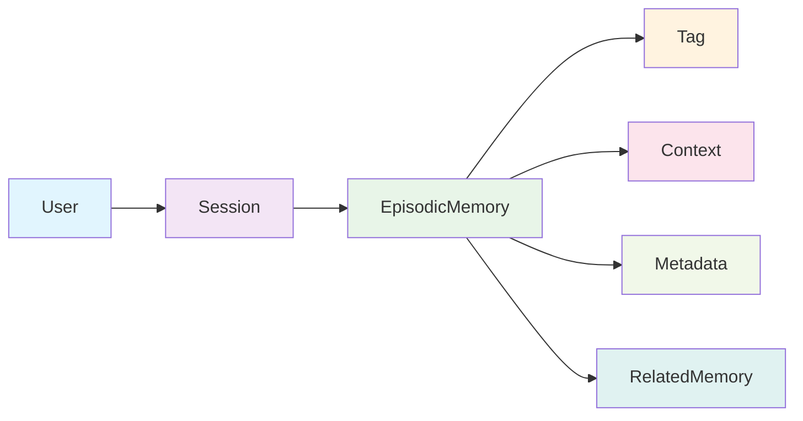

# Neo4j Integration Guide

Neo4j is the heart of our episodic memory system, storing conversation history, user interactions, and temporal relationships in a graph database. This guide explains why we chose Neo4j and how to work with it effectively.

## 🎯 Why Neo4j for Episodic Memory?

### The Problem with Traditional Databases
Traditional relational databases (like MySQL, PostgreSQL) are excellent for structured data, but they struggle with:

- **Complex Relationships**: Hard to represent many-to-many relationships
- **Temporal Queries**: Difficult to query time-based sequences
- **Flexible Schema**: Adding new relationship types requires schema changes
- **Graph Traversals**: Finding connected data requires complex JOINs

### Why Neo4j Excels
Neo4j is a graph database designed specifically for relationship-heavy data:

- **Native Graph Structure**: Relationships are first-class citizens
- **Cypher Query Language**: Intuitive language for graph queries
- **Flexible Schema**: Easy to add new node types and relationships
- **Performance**: Fast queries even with deep relationship traversals
- **Temporal Support**: Excellent handling of time-based data

## 🏗️ Graph Data Model

### Core Node Types



### Node Properties

#### User Node
```cypher
(:User {
  id: "user-123",
  username: "john_doe",
  createdAt: "2024-01-01T00:00:00Z",
  preferences: {
    language: "en",
    timezone: "UTC",
    theme: "dark"
  }
})
```

#### Session Node
```cypher
(:Session {
  id: "session-456",
  userId: "user-123",
  startedAt: "2024-01-15T10:00:00Z",
  endedAt: "2024-01-15T11:30:00Z",
  platform: "web",
  userAgent: "Mozilla/5.0...",
  metadata: {
    ipAddress: "192.168.1.100",
    location: "San Francisco, CA"
  }
})
```

#### EpisodicMemory Node
```cypher
(:EpisodicMemory {
  id: "memory-789",
  content: "User asked about React hooks and state management",
  timestamp: "2024-01-15T10:30:00Z",
  importance: 0.8,
  source: "chat",
  type: "conversation",
  metadata: {
    conversationTurn: 5,
    topic: "React",
    sentiment: "positive",
    confidence: 0.9
  }
})
```

### Relationship Types

#### Temporal Relationships
```cypher
// Previous memory in sequence
(memory1:EpisodicMemory)-[:PREVIOUS]->(memory2:EpisodicMemory)

// Next memory in sequence
(memory1:EpisodicMemory)-[:NEXT]->(memory2:EpisodicMemory)

// Memory in same conversation
(memory1:EpisodicMemory)-[:IN_SAME_CONVERSATION]->(memory2:EpisodicMemory)
```

#### Hierarchical Relationships
```cypher
// User owns session
(user:User)-[:OWNS]->(session:Session)

// Session contains memory
(session:Session)-[:CONTAINS]->(memory:EpisodicMemory)

// Memory belongs to user
(memory:EpisodicMemory)-[:BELONGS_TO]->(user:User)
```

#### Semantic Relationships
```cypher
// Related memories
(memory1:EpisodicMemory)-[:RELATED_TO {strength: 0.7}]->(memory2:EpisodicMemory)

// Memory references concept
(memory:EpisodicMemory)-[:REFERENCES]->(concept:Concept)

// Memory has tag
(memory:EpisodicMemory)-[:HAS_TAG]->(tag:Tag)
```

## 🔍 Cypher Query Examples

### Basic Memory Retrieval

#### Get All Memories for a User
```cypher
MATCH (u:User {id: "user-123"})-[:OWNS]->(s:Session)-[:CONTAINS]->(m:EpisodicMemory)
RETURN m.content, m.timestamp, m.importance
ORDER BY m.timestamp DESC
```

#### Get Recent Memories
```cypher
MATCH (u:User {id: "user-123"})-[:OWNS]->(s:Session)-[:CONTAINS]->(m:EpisodicMemory)
WHERE m.timestamp > datetime() - duration('P7D') // Last 7 days
RETURN m
ORDER BY m.timestamp DESC
LIMIT 10
```

#### Search Memories by Content
```cypher
MATCH (u:User {id: "user-123"})-[:OWNS]->(s:Session)-[:CONTAINS]->(m:EpisodicMemory)
WHERE m.content CONTAINS "React" OR m.content CONTAINS "hooks"
RETURN m.content, m.timestamp, m.importance
ORDER BY m.importance DESC
```

### Advanced Relationship Queries

#### Find Related Memories
```cypher
MATCH (m1:EpisodicMemory {id: "memory-789"})-[:RELATED_TO]->(m2:EpisodicMemory)
RETURN m2.content, m2.timestamp
ORDER BY m2.timestamp DESC
```

#### Get Memory Context (Surrounding Memories)
```cypher
MATCH (m:EpisodicMemory {id: "memory-789"})
OPTIONAL MATCH (m)-[:PREVIOUS]->(prev:EpisodicMemory)
OPTIONAL MATCH (m)-[:NEXT]->(next:EpisodicMemory)
RETURN prev.content as previous, m.content as current, next.content as next
```

#### Find Memories by Tag
```cypher
MATCH (u:User {id: "user-123"})-[:OWNS]->(s:Session)-[:CONTAINS]->(m:EpisodicMemory)-[:HAS_TAG]->(t:Tag {name: "React"})
RETURN m.content, m.timestamp
ORDER BY m.timestamp DESC
```

### Complex Analysis Queries

#### Memory Importance Over Time
```cypher
MATCH (u:User {id: "user-123"})-[:OWNS]->(s:Session)-[:CONTAINS]->(m:EpisodicMemory)
WHERE m.timestamp > datetime() - duration('P30D')
RETURN date(m.timestamp) as date, avg(m.importance) as avg_importance, count(m) as memory_count
ORDER BY date DESC
```

#### Find Conversation Patterns
```cypher
MATCH (u:User {id: "user-123"})-[:OWNS]->(s:Session)-[:CONTAINS]->(m:EpisodicMemory)
WHERE m.type = "conversation"
WITH s, collect(m) as memories
WHERE size(memories) > 5 // Sessions with more than 5 memories
RETURN s.id, size(memories) as conversation_length, 
       avg([m in memories | m.importance]) as avg_importance
ORDER BY conversation_length DESC
```

## 🚀 Practical Implementation

### Setting Up Neo4j

#### 1. Installation
```bash
# Using Docker (Recommended)
docker run -d \
  --name neo4j \
  -p 7474:7474 -p 7687:7687 \
  -e NEO4J_AUTH=neo4j/your_password \
  -e NEO4J_PLUGINS='["apoc"]' \
  neo4j:latest

# Or download Neo4j Desktop from https://neo4j.com/download/
```

#### 2. Environment Configuration
```env
# packages/server/.env
NEO4J_URI=bolt://localhost:7687
NEO4J_USERNAME=neo4j
NEO4J_PASSWORD=your_password
NEO4J_DATABASE=neo4j
```

#### 3. Connection Test
```typescript
import neo4j from 'neo4j-driver';

const driver = neo4j.driver(
  process.env.NEO4J_URI!,
  neo4j.auth.basic(process.env.NEO4J_USERNAME!, process.env.NEO4J_PASSWORD!)
);

// Test connection
const session = driver.session();
const result = await session.run('RETURN 1 as test');
console.log('Neo4j connected:', result.records[0].get('test'));
await session.close();
```

### Memory Operations

#### Store Episodic Memory
```typescript
async function storeEpisodicMemory(memoryData: EpisodicMemoryData) {
  const session = driver.session();
  
  try {
    const result = await session.run(`
      MATCH (u:User {id: $userId})
      MATCH (s:Session {id: $sessionId})
      CREATE (m:EpisodicMemory {
        id: $id,
        content: $content,
        timestamp: datetime($timestamp),
        importance: $importance,
        source: $source,
        type: $type,
        metadata: $metadata
      })
      CREATE (s)-[:CONTAINS]->(m)
      CREATE (m)-[:BELONGS_TO]->(u)
      RETURN m
    `, {
      userId: memoryData.userId,
      sessionId: memoryData.sessionId,
      id: memoryData.id,
      content: memoryData.content,
      timestamp: memoryData.timestamp,
      importance: memoryData.importance,
      source: memoryData.source,
      type: memoryData.type,
      metadata: memoryData.metadata
    });
    
    return result.records[0].get('m');
  } finally {
    await session.close();
  }
}
```

#### Search Memories
```typescript
async function searchMemories(userId: string, query: string, limit: number = 10) {
  const session = driver.session();
  
  try {
    const result = await session.run(`
      MATCH (u:User {id: $userId})-[:OWNS]->(s:Session)-[:CONTAINS]->(m:EpisodicMemory)
      WHERE m.content CONTAINS $query
      RETURN m.content, m.timestamp, m.importance
      ORDER BY m.importance DESC, m.timestamp DESC
      LIMIT $limit
    `, { userId, query, limit });
    
    return result.records.map(record => ({
      content: record.get('m.content'),
      timestamp: record.get('m.timestamp'),
      importance: record.get('m.importance')
    }));
  } finally {
    await session.close();
  }
}
```

#### Create Memory Relationships
```typescript
async function createMemoryRelationship(
  memoryId1: string, 
  memoryId2: string, 
  relationshipType: string,
  strength: number = 1.0
) {
  const session = driver.session();
  
  try {
    await session.run(`
      MATCH (m1:EpisodicMemory {id: $memoryId1})
      MATCH (m2:EpisodicMemory {id: $memoryId2})
      CREATE (m1)-[:${relationshipType} {strength: $strength}]->(m2)
    `, { memoryId1, memoryId2, strength });
  } finally {
    await session.close();
  }
}
```

## 📊 Performance Optimization

### Indexing Strategy
```cypher
// Create indexes for common queries
CREATE INDEX user_id_index FOR (u:User) ON (u.id);
CREATE INDEX session_id_index FOR (s:Session) ON (s.id);
CREATE INDEX memory_timestamp_index FOR (m:EpisodicMemory) ON (m.timestamp);
CREATE INDEX memory_importance_index FOR (m:EpisodicMemory) ON (m.importance);
CREATE INDEX memory_content_index FOR (m:EpisodicMemory) ON (m.content);
```

### Query Optimization Tips

#### 1. Use Specific Node Labels
```cypher
// Good: Specific label
MATCH (u:User {id: "user-123"})

// Bad: Generic label
MATCH (n {id: "user-123"})
```

#### 2. Limit Result Sets Early
```cypher
// Good: Limit early
MATCH (u:User {id: "user-123"})-[:OWNS]->(s:Session)-[:CONTAINS]->(m:EpisodicMemory)
WHERE m.timestamp > datetime() - duration('P7D')
RETURN m
ORDER BY m.timestamp DESC
LIMIT 10

// Bad: Limit late
MATCH (u:User {id: "user-123"})-[:OWNS]->(s:Session)-[:CONTAINS]->(m:EpisodicMemory)
RETURN m
ORDER BY m.timestamp DESC
LIMIT 10
```

#### 3. Use EXPLAIN and PROFILE
```cypher
// Analyze query performance
EXPLAIN MATCH (u:User {id: "user-123"})-[:OWNS]->(s:Session)-[:CONTAINS]->(m:EpisodicMemory)
RETURN m

// Profile actual execution
PROFILE MATCH (u:User {id: "user-123"})-[:OWNS]->(s:Session)-[:CONTAINS]->(m:EpisodicMemory)
RETURN m
```

## 🔧 Troubleshooting

### Common Issues

#### 1. Connection Problems
```bash
# Check if Neo4j is running
docker ps | grep neo4j

# Check logs
docker logs neo4j

# Test connection
cypher-shell -u neo4j -p your_password
```

#### 2. Query Performance Issues
```cypher
// Check query plan
EXPLAIN MATCH (u:User {id: "user-123"})-[:OWNS]->(s:Session)-[:CONTAINS]->(m:EpisodicMemory)
RETURN m

// Check indexes
SHOW INDEXES

// Check constraints
SHOW CONSTRAINTS
```

#### 3. Memory Issues
```cypher
// Check database size
CALL dbms.listConfig() YIELD name, value
WHERE name CONTAINS "memory"
RETURN name, value

// Check node counts
MATCH (n) RETURN labels(n) as label, count(n) as count
ORDER BY count DESC
```

## 🎯 Best Practices

### 1. Data Modeling
- **Keep nodes simple**: Store only essential properties
- **Use relationships for structure**: Don't duplicate data in properties
- **Plan for growth**: Design schema to handle increasing data

### 2. Query Writing
- **Start specific, get general**: Begin with specific nodes, then traverse
- **Use parameters**: Always use parameters for user input
- **Test with EXPLAIN**: Understand query execution plans

### 3. Performance
- **Create appropriate indexes**: Index frequently queried properties
- **Monitor query performance**: Use PROFILE to identify bottlenecks
- **Batch operations**: Group multiple operations when possible

### 4. Maintenance
- **Regular backups**: Set up automated backup procedures
- **Monitor disk usage**: Graph databases can grow quickly
- **Update statistics**: Keep database statistics current

## 🚀 Next Steps

Now that you understand Neo4j integration, explore:

1. **[Pinecone Vector Database](./pinecone-vectors.md)** - Semantic memory with vectors
2. **[Ollama Embeddings](./ollama-embeddings.md)** - Local text embeddings
3. **[Memory Examples](./memory-examples.md)** - Practical usage scenarios
4. **[Troubleshooting Guide](./memory-troubleshooting.md)** - Common issues and solutions

---

*Ready to learn about vector databases? Check out the [Pinecone Integration Guide](./pinecone-vectors.md)!*
