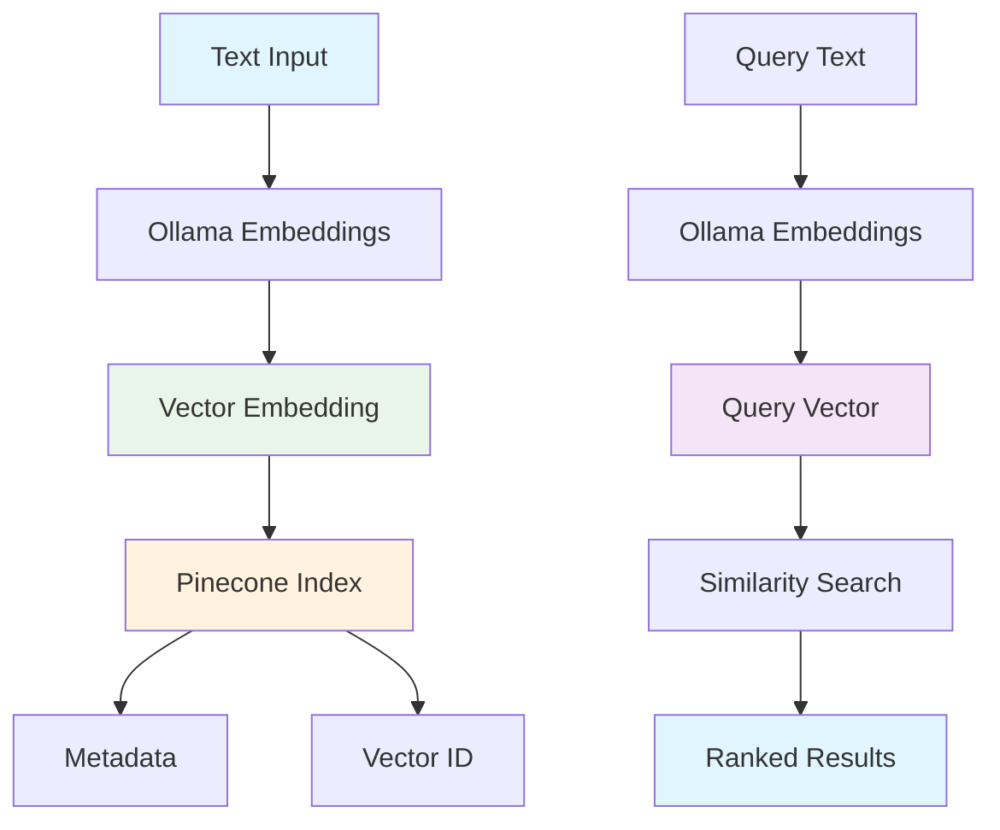

# Pinecone Vector Database Guide

Pinecone is our semantic memory powerhouse, storing knowledge, concepts, and facts as vector embeddings. This guide explains how vector databases work, why we chose Pinecone, and how to use it effectively for semantic memory.

## 🎯 What are Vector Embeddings?

### The Problem with Text Search
Traditional text search has limitations:
- **Exact Match Only**: "machine learning" won't find "ML" or "artificial intelligence"
- **No Semantic Understanding**: Can't understand that "car" and "automobile" are related
- **Language Barriers**: "hello" and "hola" are treated as completely different
- **Context Loss**: "bank" could mean financial institution or river edge

### The Vector Solution
Vector embeddings solve these problems by converting text into numerical representations that capture meaning:

```typescript
// Text input
const text = "machine learning algorithms";

// Vector embedding (simplified - actual vectors have 768 dimensions)
const embedding = [0.1, 0.3, 0.7, 0.2, 0.9, 0.4, 0.6, 0.8, ...];
```

**Key Properties of Vectors:**
- **Similarity**: Similar concepts have similar vectors
- **Distance**: Vector distance represents semantic similarity
- **Dimensionality**: Higher dimensions = more nuanced understanding
- **Language Agnostic**: Same concept in different languages has similar vectors

## 🧠 How Vector Similarity Works

### Cosine Similarity
The most common way to measure vector similarity:

```typescript
function cosineSimilarity(vecA: number[], vecB: number[]): number {
  const dotProduct = vecA.reduce((sum, a, i) => sum + a * vecB[i], 0);
  const magnitudeA = Math.sqrt(vecA.reduce((sum, a) => sum + a * a, 0));
  const magnitudeB = Math.sqrt(vecB.reduce((sum, b) => sum + b * b, 0));
  
  return dotProduct / (magnitudeA * magnitudeB);
}

// Example
const vector1 = [0.1, 0.2, 0.3]; // "machine learning"
const vector2 = [0.15, 0.25, 0.35]; // "artificial intelligence"
const similarity = cosineSimilarity(vector1, vector2); // ~0.99 (very similar)
```

### Similarity Thresholds
```typescript
const SIMILARITY_THRESHOLDS = {
  EXACT_MATCH: 0.95,      // Nearly identical
  VERY_SIMILAR: 0.85,     // Highly related
  SIMILAR: 0.70,          // Related concepts
  SOMEWHAT_SIMILAR: 0.50, // Loosely related
  DIFFERENT: 0.30         // Unrelated
};
```

## 🏗️ Pinecone Architecture

### Why Pinecone?
- **Managed Service**: No infrastructure management
- **High Performance**: Sub-second search across millions of vectors
- **Scalability**: Handles growing data automatically
- **Developer Friendly**: Simple API and excellent documentation
- **Cost Effective**: Pay only for what you use

### Data Structure



### Index Structure
```typescript
interface PineconeVector {
  id: string;                    // Unique identifier
  values: number[];              // 768-dimensional vector
  metadata: {
    content: string;             // Original text
    concept: string;             // Main concept
    category: string;            // Knowledge category
    confidence: number;          // Confidence score
    source: string;              // Where it came from
    timestamp: string;           // When it was created
    tags: string[];              // Searchable tags
    userId: string;              // User who created it
  };
}
```

## 🚀 Setting Up Pinecone

### 1. Create Pinecone Account
```bash
# Visit https://www.pinecone.io/
# Sign up for free account
# Get your API key and environment
```

### 2. Environment Configuration
```env
# packages/server/.env
PINECONE_API_KEY=your_pinecone_api_key
PINECONE_ENVIRONMENT=your_pinecone_environment
PINECONE_INDEX_NAME=clear-ai-memories
```

### 3. Initialize Pinecone
```typescript
import { Pinecone } from '@pinecone-database/pinecone';

const pinecone = new Pinecone({
  apiKey: process.env.PINECONE_API_KEY!,
  environment: process.env.PINECONE_ENVIRONMENT!
});

const index = pinecone.Index(process.env.PINECONE_INDEX_NAME!);
```

### 4. Create Index
```typescript
async function createPineconeIndex() {
  try {
    await pinecone.createIndex({
      name: 'clear-ai-memories',
      dimension: 768, // nomic-embed-text dimensions
      metric: 'cosine',
      spec: {
        serverless: {
          cloud: 'aws',
          region: 'us-east-1'
        }
      }
    });
    
    console.log('Index created successfully');
  } catch (error) {
    console.error('Error creating index:', error);
  }
}
```

## 🔍 Vector Operations

### Storing Semantic Memory
```typescript
async function storeSemanticMemory(memoryData: SemanticMemoryData) {
  try {
    // Generate embedding using Ollama
    const embedding = await generateEmbedding(memoryData.content);
    
    // Prepare vector for Pinecone
    const vector: PineconeVector = {
      id: memoryData.id,
      values: embedding,
      metadata: {
        content: memoryData.content,
        concept: memoryData.concept,
        category: memoryData.category,
        confidence: memoryData.confidence,
        source: memoryData.source,
        timestamp: memoryData.timestamp,
        tags: memoryData.tags,
        userId: memoryData.userId
      }
    };
    
    // Upsert to Pinecone
    await index.upsert([vector]);
    
    return { success: true, id: memoryData.id };
  } catch (error) {
    console.error('Error storing semantic memory:', error);
    throw error;
  }
}
```

### Searching Semantic Memory
```typescript
async function searchSemanticMemory(
  query: string, 
  userId: string, 
  limit: number = 10,
  threshold: number = 0.7
) {
  try {
    // Generate query embedding
    const queryEmbedding = await generateEmbedding(query);
    
    // Search Pinecone
    const searchResponse = await index.query({
      vector: queryEmbedding,
      topK: limit,
      includeMetadata: true,
      filter: {
        userId: { $eq: userId }
      }
    });
    
    // Filter by similarity threshold
    const results = searchResponse.matches
      ?.filter(match => match.score && match.score >= threshold)
      .map(match => ({
        id: match.id,
        content: match.metadata?.content,
        concept: match.metadata?.concept,
        category: match.metadata?.category,
        confidence: match.metadata?.confidence,
        similarity: match.score,
        tags: match.metadata?.tags
      })) || [];
    
    return results;
  } catch (error) {
    console.error('Error searching semantic memory:', error);
    throw error;
  }
}
```

### Advanced Search with Filters
```typescript
async function searchWithFilters(
  query: string,
  filters: {
    userId: string;
    category?: string;
    tags?: string[];
    minConfidence?: number;
    dateRange?: { start: string; end: string };
  },
  limit: number = 10
) {
  try {
    const queryEmbedding = await generateEmbedding(query);
    
    // Build filter object
    const pineconeFilter: any = {
      userId: { $eq: filters.userId }
    };
    
    if (filters.category) {
      pineconeFilter.category = { $eq: filters.category };
    }
    
    if (filters.tags && filters.tags.length > 0) {
      pineconeFilter.tags = { $in: filters.tags };
    }
    
    if (filters.minConfidence) {
      pineconeFilter.confidence = { $gte: filters.minConfidence };
    }
    
    if (filters.dateRange) {
      pineconeFilter.timestamp = {
        $gte: filters.dateRange.start,
        $lte: filters.dateRange.end
      };
    }
    
    const searchResponse = await index.query({
      vector: queryEmbedding,
      topK: limit,
      includeMetadata: true,
      filter: pineconeFilter
    });
    
    return searchResponse.matches?.map(match => ({
      id: match.id,
      content: match.metadata?.content,
      concept: match.metadata?.concept,
      category: match.metadata?.category,
      confidence: match.metadata?.confidence,
      similarity: match.score,
      tags: match.metadata?.tags,
      timestamp: match.metadata?.timestamp
    })) || [];
  } catch (error) {
    console.error('Error searching with filters:', error);
    throw error;
  }
}
```

## 📊 Vector Management

### Batch Operations
```typescript
async function batchUpsertMemories(memories: SemanticMemoryData[]) {
  try {
    // Generate embeddings for all memories
    const vectors = await Promise.all(
      memories.map(async (memory) => {
        const embedding = await generateEmbedding(memory.content);
        return {
          id: memory.id,
          values: embedding,
          metadata: {
            content: memory.content,
            concept: memory.concept,
            category: memory.category,
            confidence: memory.confidence,
            source: memory.source,
            timestamp: memory.timestamp,
            tags: memory.tags,
            userId: memory.userId
          }
        };
      })
    );
    
    // Upsert in batches of 100 (Pinecone limit)
    const batchSize = 100;
    for (let i = 0; i < vectors.length; i += batchSize) {
      const batch = vectors.slice(i, i + batchSize);
      await index.upsert(batch);
    }
    
    return { success: true, count: vectors.length };
  } catch (error) {
    console.error('Error batch upserting memories:', error);
    throw error;
  }
}
```

### Memory Updates
```typescript
async function updateSemanticMemory(
  id: string, 
  updates: Partial<SemanticMemoryData>
) {
  try {
    // Get existing vector
    const fetchResponse = await index.fetch([id]);
    const existingVector = fetchResponse.vectors?.[id];
    
    if (!existingVector) {
      throw new Error('Memory not found');
    }
    
    // Update metadata
    const updatedMetadata = {
      ...existingVector.metadata,
      ...updates,
      updatedAt: new Date().toISOString()
    };
    
    // If content changed, regenerate embedding
    let values = existingVector.values;
    if (updates.content) {
      values = await generateEmbedding(updates.content);
    }
    
    // Upsert updated vector
    await index.upsert([{
      id,
      values,
      metadata: updatedMetadata
    }]);
    
    return { success: true, id };
  } catch (error) {
    console.error('Error updating semantic memory:', error);
    throw error;
  }
}
```

### Memory Deletion
```typescript
async function deleteSemanticMemory(id: string) {
  try {
    await index.deleteOne(id);
    return { success: true, id };
  } catch (error) {
    console.error('Error deleting semantic memory:', error);
    throw error;
  }
}

async function deleteUserMemories(userId: string) {
  try {
    // Delete all vectors for a user
    await index.deleteMany({
      filter: {
        userId: { $eq: userId }
      }
    });
    
    return { success: true, userId };
  } catch (error) {
    console.error('Error deleting user memories:', error);
    throw error;
  }
}
```

## 🎯 Real-World Examples

### Example 1: Knowledge Base Search
```typescript
// Store knowledge about React
await storeSemanticMemory({
  id: 'react-hooks-knowledge',
  content: 'React hooks are functions that let you use state and lifecycle features in functional components',
  concept: 'React Hooks',
  category: 'frontend',
  confidence: 0.9,
  source: 'documentation',
  timestamp: new Date().toISOString(),
  tags: ['React', 'hooks', 'functional-components', 'state'],
  userId: 'user-123'
});

// Search for similar knowledge
const results = await searchSemanticMemory(
  'How do I use state in React components?',
  'user-123',
  5,
  0.7
);

// Results will include the React hooks knowledge even though
// the query uses different wording
```

### Example 2: Concept Learning
```typescript
// Store learning progress
await storeSemanticMemory({
  id: 'user-learned-promises',
  content: 'User successfully implemented async/await with Promises in JavaScript',
  concept: 'JavaScript Promises',
  category: 'learning-progress',
  confidence: 0.8,
  source: 'code-review',
  timestamp: new Date().toISOString(),
  tags: ['JavaScript', 'Promises', 'async-await', 'learning'],
  userId: 'user-123'
});

// Later, when user asks about async programming
const results = await searchSemanticMemory(
  'I need help with asynchronous programming',
  'user-123',
  10,
  0.6
);

// System knows user already learned Promises and can provide
// more advanced async programming concepts
```

### Example 3: Contextual Recommendations
```typescript
// Store user preferences
await storeSemanticMemory({
  id: 'user-prefers-typescript',
  content: 'User prefers TypeScript over JavaScript for type safety',
  concept: 'Programming Language Preference',
  category: 'user-preferences',
  confidence: 0.9,
  source: 'conversation',
  timestamp: new Date().toISOString(),
  tags: ['TypeScript', 'JavaScript', 'preferences', 'type-safety'],
  userId: 'user-123'
});

// When suggesting solutions, system will prioritize TypeScript examples
const results = await searchSemanticMemory(
  'How do I handle errors in my code?',
  'user-123',
  5,
  0.7
);

// Results will be filtered to show TypeScript error handling patterns
```

## 🔧 Performance Optimization

### Index Configuration
```typescript
// Optimize for your use case
const indexConfig = {
  name: 'clear-ai-memories',
  dimension: 768,
  metric: 'cosine', // Best for text similarity
  spec: {
    serverless: {
      cloud: 'aws',
      region: 'us-east-1'
    }
  }
};
```

### Query Optimization
```typescript
// Use appropriate topK values
const searchConfig = {
  topK: 10,        // Don't fetch more than needed
  includeMetadata: true, // Only if you need metadata
  filter: {        // Use filters to reduce search space
    userId: { $eq: userId }
  }
};
```

### Caching Strategy
```typescript
// Cache frequently accessed vectors
const vectorCache = new Map<string, number[]>();

async function getCachedEmbedding(text: string): Promise<number[]> {
  if (vectorCache.has(text)) {
    return vectorCache.get(text)!;
  }
  
  const embedding = await generateEmbedding(text);
  vectorCache.set(text, embedding);
  
  // Limit cache size
  if (vectorCache.size > 1000) {
    const firstKey = vectorCache.keys().next().value;
    vectorCache.delete(firstKey);
  }
  
  return embedding;
}
```

## 🚨 Troubleshooting

### Common Issues

#### 1. Index Not Found
```typescript
// Check if index exists
const indexes = await pinecone.listIndexes();
console.log('Available indexes:', indexes);

// Create index if it doesn't exist
if (!indexes.includes('clear-ai-memories')) {
  await createPineconeIndex();
}
```

#### 2. Dimension Mismatch
```typescript
// Ensure embedding dimensions match index
const embedding = await generateEmbedding(text);
console.log('Embedding dimensions:', embedding.length); // Should be 768

// Check index configuration
const indexStats = await index.describeIndexStats();
console.log('Index dimensions:', indexStats.dimension);
```

#### 3. Query Timeout
```typescript
// Add timeout to queries
const searchResponse = await index.query({
  vector: queryEmbedding,
  topK: 10,
  includeMetadata: true,
  filter: { userId: { $eq: userId } }
}).timeout(5000); // 5 second timeout
```

#### 4. Rate Limiting
```typescript
// Implement rate limiting
class RateLimitedPinecone {
  private lastRequest = 0;
  private minInterval = 100; // 100ms between requests
  
  async query(params: any) {
    const now = Date.now();
    const timeSinceLastRequest = now - this.lastRequest;
    
    if (timeSinceLastRequest < this.minInterval) {
      await new Promise(resolve => 
        setTimeout(resolve, this.minInterval - timeSinceLastRequest)
      );
    }
    
    this.lastRequest = Date.now();
    return index.query(params);
  }
}
```

## 🎯 Best Practices

### 1. Data Organization
- **Use meaningful IDs**: Include user and concept information
- **Rich metadata**: Store all relevant information in metadata
- **Consistent tags**: Use standardized tag naming conventions
- **User isolation**: Always filter by userId for security

### 2. Query Strategy
- **Appropriate thresholds**: Start with 0.7, adjust based on results
- **Limit results**: Don't fetch more than needed
- **Use filters**: Reduce search space with metadata filters
- **Cache embeddings**: Avoid regenerating same embeddings

### 3. Performance
- **Batch operations**: Group multiple upserts
- **Monitor usage**: Track API calls and costs
- **Optimize dimensions**: Use appropriate embedding model
- **Regular cleanup**: Remove outdated or low-quality vectors

### 4. Security
- **User isolation**: Never mix user data
- **Input validation**: Sanitize all inputs
- **Access control**: Implement proper authentication
- **Data encryption**: Use HTTPS for all API calls

## 🚀 Next Steps

Now that you understand Pinecone vectors, explore:

1. **[Ollama Embeddings](./ollama-embeddings.md)** - Local text embedding generation
2. **[Memory Examples](./memory-examples.md)** - Practical usage scenarios
3. **[Troubleshooting Guide](./memory-troubleshooting.md)** - Common issues and solutions
4. **[Memory System Overview](./memory-system-overview.md)** - Complete system understanding

---

*Ready to learn about local embeddings? Check out the [Ollama Integration Guide](./ollama-embeddings.md)!*
