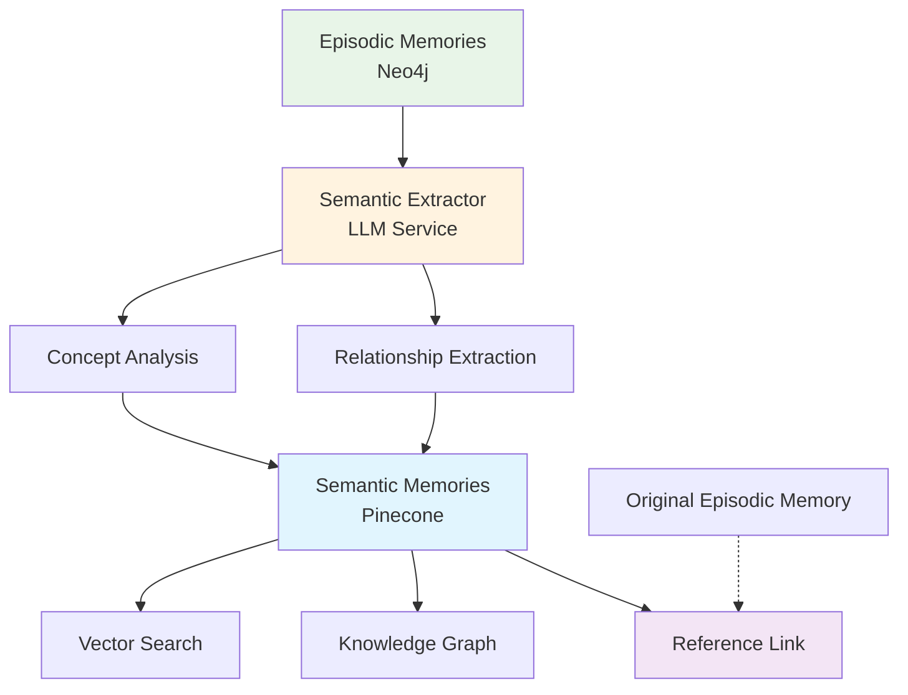

# Semantic Extraction System

The Semantic Extraction System is an advanced feature that addresses the redundancy issue between Pinecone and Neo4j memory storage by using LLM-powered analysis to extract only the essential semantic information from episodic memories.

## 🎯 Problem Solved

### The Redundancy Issue

Previously, both memory systems stored overlapping information:
- **Neo4j (Episodic)**: Raw conversation content, context, metadata, relationships
- **Pinecone (Semantic)**: Similar concepts, descriptions, metadata, relationships

This led to:
- Duplicate data storage
- Inefficient memory usage
- Redundant relationship information
- Higher storage costs

### The Solution

The Semantic Extraction System processes episodic memories through an LLM to extract only the distilled semantic concepts and relationships, storing them in Pinecone while maintaining references to the original episodic memories.

## 🏗️ Architecture



## 🔧 How It Works

### 1. Episodic Memory Processing

The system retrieves episodic memories from Neo4j and processes them in batches:

```typescript
const episodicMemories = await memoryService.searchEpisodicMemories({
  userId: 'user123',
  query: '',
  type: 'episodic',
  limit: 100
});
```

### 2. LLM-Based Extraction

The `SemanticExtractorService` uses an LLM to analyze episodic memories and extract:

- **Concepts**: Key ideas, topics, and entities
- **Descriptions**: Clear explanations of each concept
- **Categories**: Organized classification
- **Relationships**: How concepts relate to each other
- **Confidence Scores**: Reliability of the extraction

### 3. Semantic Memory Creation

Extracted concepts are converted to semantic memories with:

```typescript
interface SemanticMemory {
  concept: string;
  description: string;
  metadata: {
    category: string;
    confidence: number;
    extractionMetadata: {
      sourceMemoryIds: string[]; // Links to original episodic memories
      extractionTimestamp: Date;
      extractionConfidence: number;
      keywords: string[];
      processingTime: number;
    };
  };
  relationships: {
    similar?: string[];
    parent?: string;
    children?: string[];
    related?: string[];
    causes?: string[];
    // ... more relationship types
  };
}
```

## 🚀 Usage

### Basic Extraction

```typescript
// Extract semantic information from all episodic memories
const result = await memoryService.extractSemanticFromEpisodic('user123');

console.log(`Extracted ${result.extractedConcepts} concepts`);
console.log(`Found ${result.extractedRelationships} relationships`);
console.log(`Processing time: ${result.processingTime}ms`);
```

### Session-Specific Extraction

```typescript
// Extract from a specific session
const result = await memoryService.extractSemanticFromEpisodic('user123', 'session456');
```

### Get Extraction Statistics

```typescript
const stats = await memoryService.getSemanticExtractionStats('user123');

console.log(`Total extractions: ${stats.totalExtractions}`);
console.log(`Average confidence: ${stats.averageConfidence}`);
console.log(`Concepts by category:`, stats.conceptsByCategory);
```

## ⚙️ Configuration

Configure the semantic extraction system in your memory service config:

```typescript
const config: MemoryServiceConfig = {
  // ... other config
  semanticExtraction: {
    enabled: true,
    minConfidence: 0.7,           // Minimum confidence for concepts
    maxConceptsPerMemory: 3,      // Max concepts per episodic memory
    enableRelationshipExtraction: true,
    categories: [                 // Allowed categories
      'AI', 'Technology', 'Programming', 
      'Science', 'General'
    ],
    batchSize: 5                  // Memories per batch
  }
};
```

## 📊 Benefits

### 1. Reduced Redundancy
- Only essential semantic information stored in Pinecone
- Episodic memories remain in Neo4j for temporal context
- Clear separation of concerns

### 2. Improved Efficiency
- Smaller Pinecone storage footprint
- Faster vector searches
- Better memory utilization

### 3. Enhanced Relationships
- Rich relationship types (causes, part_of, opposite, etc.)
- LLM-identified connections between concepts
- Hierarchical concept organization

### 4. Traceability
- Each semantic memory links back to source episodic memories
- Full extraction metadata for debugging
- Confidence scoring for reliability

## 🔍 Example Workflow

### Input: Episodic Memory
```json
{
  "content": "User asked about machine learning algorithms and neural networks",
  "context": { "topic": "AI", "conversation_turn": 1 },
  "metadata": {
    "tags": ["AI", "machine learning", "neural networks"],
    "importance": 0.9
  }
}
```

### Output: Semantic Memories
```json
[
  {
    "concept": "Machine Learning",
    "description": "A subset of artificial intelligence that focuses on algorithms that can learn from data",
    "metadata": {
      "category": "AI",
      "confidence": 0.9,
      "extractionMetadata": {
        "sourceMemoryIds": ["memory-123"],
        "keywords": ["algorithms", "learning", "data"]
      }
    },
    "relationships": {
      "children": ["neural-networks"],
      "related": ["artificial-intelligence"]
    }
  },
  {
    "concept": "Neural Networks",
    "description": "Computing systems inspired by biological neural networks",
    "metadata": {
      "category": "AI",
      "confidence": 0.85,
      "extractionMetadata": {
        "sourceMemoryIds": ["memory-123"],
        "keywords": ["networks", "neurons", "computing"]
      }
    },
    "relationships": {
      "parent": "machine-learning",
      "related": ["deep-learning"]
    }
  }
]
```

## 🧪 Testing

Run the test script to see the system in action:

```bash
node test-semantic-extraction.js
```

This will:
1. Create sample episodic memories
2. Run semantic extraction
3. Display extracted concepts and relationships
4. Show extraction statistics

## 🔧 Advanced Features

### Custom Categories
Define your own concept categories based on your domain:

```typescript
categories: ['Medical', 'Legal', 'Financial', 'Technical', 'Personal']
```

### Relationship Types
The system supports various relationship types:
- `similar`: Similar concepts
- `parent`/`child`: Hierarchical relationships
- `related`: General associations
- `causes`/`causedBy`: Causal relationships
- `partOf`/`hasParts`: Composition relationships
- `opposite`: Opposite concepts
- `instanceOf`: Type relationships

### Batch Processing
Process memories in configurable batches to optimize LLM usage:

```typescript
batchSize: 5  // Process 5 memories at a time
```

## 🚨 Important Notes

1. **LLM Dependency**: Requires a working LLM service (OpenAI, Anthropic, etc.)
2. **Pinecone Required**: Semantic memories are stored in Pinecone
3. **Processing Time**: Extraction can take time depending on memory volume
4. **Confidence Filtering**: Only concepts above the confidence threshold are stored
5. **Memory Links**: Always maintains references to original episodic memories

## 🔮 Future Enhancements

- **Incremental Extraction**: Only process new memories
- **Custom Extractors**: Domain-specific extraction logic
- **Real-time Processing**: Extract concepts as memories are created
- **Advanced Relationships**: More sophisticated relationship detection
- **Quality Metrics**: Track extraction quality over time

This semantic extraction system transforms your memory architecture from redundant storage to an intelligent, efficient knowledge management system that learns and grows with your conversations.
