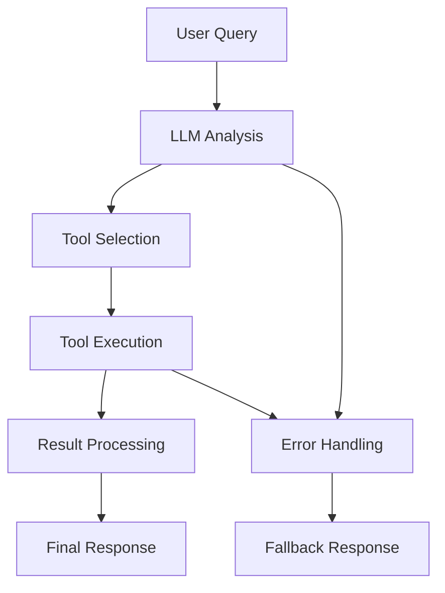

# Creating Workflows with LangGraph

This tutorial will teach you how to create sophisticated AI workflows using LangGraph in Clear AI. We'll build a multi-step workflow that processes user data, makes API calls, and generates reports.

## What You'll Learn

By the end of this tutorial, you'll know how to:
- Design multi-step AI workflows
- Use LangGraph for workflow orchestration
- Chain tools together intelligently
- Handle errors and edge cases
- Test and debug workflows

## Prerequisites

- Clear AI running locally
- Understanding of the [tool system](/docs/tutorials/building-your-first-tool)
- Basic knowledge of AI/LLM concepts

## Step 1: Understanding Workflows

A workflow in Clear AI is a sequence of steps that can:
- Execute tools in order
- Use LLM to make decisions
- Pass data between steps
- Handle errors gracefully
- Support parallel execution



## Step 2: Create a User Research Workflow

Let's build a workflow that researches a user by:
1. Fetching user data from an API
2. Getting additional information from another source
3. Analyzing the data with an LLM
4. Generating a comprehensive report

### Step 2.1: Define the Workflow

Create a new workflow file:

```bash
# Navigate to shared package
cd packages/shared/src/workflows

# Create the user research workflow
touch UserResearchWorkflow.ts
```

```typescript
// packages/shared/src/workflows/UserResearchWorkflow.ts
import { z } from 'zod';
import { LLMProvider } from '../services/LLMProvider';
import { ToolRegistry } from '@clear-ai/mcp-basic';

// Input schema for the workflow
const UserResearchInputSchema = z.object({
  userId: z.string().min(1, 'User ID is required'),
  includeSocialMedia: z.boolean().default(false),
  includeFinancial: z.boolean().default(false),
  reportFormat: z.enum(['summary', 'detailed', 'executive']).default('summary'),
});

// Output schema for the workflow
const UserResearchOutputSchema = z.object({
  userId: string;
  userData: any;
  additionalData: any;
  analysis: string;
  report: string;
  confidence: number;
  sources: string[];
  timestamp: string;
});

export class UserResearchWorkflow {
  constructor(
    private llmProvider: LLMProvider,
    private toolRegistry: ToolRegistry
  ) {}

  async execute(input: z.infer<typeof UserResearchInputSchema>): Promise<z.infer<typeof UserResearchOutputSchema>> {
    const { userId, includeSocialMedia, includeFinancial, reportFormat } = UserResearchInputSchema.parse(input);
    
    const startTime = Date.now();
    const sources: string[] = [];
    
    try {
      // Step 1: Fetch basic user data
      const userData = await this.fetchUserData(userId);
      sources.push('User API');
      
      // Step 2: Fetch additional data based on requirements
      const additionalData = await this.fetchAdditionalData(userId, {
        includeSocialMedia,
        includeFinancial,
      });
      
      if (includeSocialMedia) sources.push('Social Media API');
      if (includeFinancial) sources.push('Financial API');
      
      // Step 3: Analyze data with LLM
      const analysis = await this.analyzeData(userData, additionalData);
      
      // Step 4: Generate report
      const report = await this.generateReport(userData, additionalData, analysis, reportFormat);
      
      // Step 5: Calculate confidence score
      const confidence = await this.calculateConfidence(userData, additionalData, analysis);
      
      return {
        userId,
        userData,
        additionalData,
        analysis,
        report,
        confidence,
        sources,
        timestamp: new Date().toISOString(),
      };
      
    } catch (error) {
      throw new Error(`User research workflow failed: ${error.message}`);
    }
  }

  private async fetchUserData(userId: string): Promise<any> {
    // Use the API call tool to fetch user data
    const result = await this.toolRegistry.executeTool('api_call', {
      url: `https://jsonplaceholder.typicode.com/users/${userId}`,
      method: 'GET',
      headers: {
        'Accept': 'application/json',
      },
    });
    
    if (!result.success) {
      throw new Error(`Failed to fetch user data: ${result.error}`);
    }
    
    return result.data;
  }

  private async fetchAdditionalData(userId: string, options: {
    includeSocialMedia: boolean;
    includeFinancial: boolean;
  }): Promise<any> {
    const additionalData: any = {};
    
    // Fetch social media data if requested
    if (options.includeSocialMedia) {
      try {
        const socialResult = await this.toolRegistry.executeTool('api_call', {
          url: `https://api.example.com/social/${userId}`,
          method: 'GET',
        });
        
        if (socialResult.success) {
          additionalData.socialMedia = socialResult.data;
        }
      } catch (error) {
        console.warn('Failed to fetch social media data:', error.message);
      }
    }
    
    // Fetch financial data if requested
    if (options.includeFinancial) {
      try {
        const financialResult = await this.toolRegistry.executeTool('api_call', {
          url: `https://api.example.com/financial/${userId}`,
          method: 'GET',
        });
        
        if (financialResult.success) {
          additionalData.financial = financialResult.data;
        }
      } catch (error) {
        console.warn('Failed to fetch financial data:', error.message);
      }
    }
    
    return additionalData;
  }

  private async analyzeData(userData: any, additionalData: any): Promise<string> {
    const prompt = `
Analyze the following user data and provide insights:

User Data:
${JSON.stringify(userData, null, 2)}

Additional Data:
${JSON.stringify(additionalData, null, 2)}

Please provide:
1. Key insights about the user
2. Patterns or trends you notice
3. Potential risks or opportunities
4. Recommendations for engagement

Keep the analysis concise but comprehensive.
    `;
    
    const response = await this.llmProvider.complete(prompt, {
      temperature: 0.3,
      maxTokens: 1000,
    });
    
    return response.content;
  }

  private async generateReport(
    userData: any,
    additionalData: any,
    analysis: string,
    format: 'summary' | 'detailed' | 'executive'
  ): Promise<string> {
    const formatInstructions = {
      summary: 'Create a brief summary report (2-3 paragraphs)',
      detailed: 'Create a comprehensive detailed report with sections',
      executive: 'Create an executive summary with key points and recommendations',
    };
    
    const prompt = `
${formatInstructions[format]} based on the following data:

User Data: ${JSON.stringify(userData, null, 2)}
Additional Data: ${JSON.stringify(additionalData, null, 2)}
Analysis: ${analysis}

Format: ${format}
    `;
    
    const response = await this.llmProvider.complete(prompt, {
      temperature: 0.2,
      maxTokens: 2000,
    });
    
    return response.content;
  }

  private async calculateConfidence(
    userData: any,
    additionalData: any,
    analysis: string
  ): Promise<number> {
    // Simple confidence calculation based on data completeness
    let confidence = 0.5; // Base confidence
    
    // Increase confidence based on data availability
    if (userData && Object.keys(userData).length > 0) {
      confidence += 0.3;
    }
    
    if (additionalData && Object.keys(additionalData).length > 0) {
      confidence += 0.2;
    }
    
    // Ensure confidence is between 0 and 1
    return Math.min(Math.max(confidence, 0), 1);
  }
}
```

## Step 3: Create a Workflow Controller

Now let's create a controller to handle workflow execution:

```typescript
// packages/server/src/controllers/workflowController.ts
import { Request, Response } from 'express';
import { UserResearchWorkflow } from '@clear-ai/shared';
import { ToolRegistry } from '@clear-ai/mcp-basic';
import { ToolSelector } from '@clear-ai/shared';

export class WorkflowController {
  private userResearchWorkflow: UserResearchWorkflow;

  constructor(toolRegistry: ToolRegistry, toolSelector: ToolSelector) {
    this.userResearchWorkflow = new UserResearchWorkflow(toolSelector, toolRegistry);
  }

  async executeUserResearch(req: Request, res: Response): Promise<void> {
    try {
      const { userId, includeSocialMedia, includeFinancial, reportFormat } = req.body;
      
      const result = await this.userResearchWorkflow.execute({
        userId,
        includeSocialMedia: includeSocialMedia || false,
        includeFinancial: includeFinancial || false,
        reportFormat: reportFormat || 'summary',
      });
      
      res.json({
        success: true,
        data: result,
        message: 'User research workflow completed successfully',
      });
      
    } catch (error) {
      res.status(500).json({
        success: false,
        message: 'Workflow execution failed',
        error: error.message,
      });
    }
  }
}
```

## Step 4: Add Workflow Routes

Create routes for the workflow:

```typescript
// packages/server/src/routes/workflowRoutes.ts
import { Router } from 'express';
import { WorkflowController } from '../controllers/workflowController';

const router = Router();
const workflowController = new WorkflowController(toolRegistry, toolSelector);

/**
 * @swagger
 * /api/workflows/user-research:
 *   post:
 *     summary: Execute user research workflow
 *     tags: [Workflows]
 *     requestBody:
 *       required: true
 *       content:
 *         application/json:
 *           schema:
 *             type: object
 *             required:
 *               - userId
 *             properties:
 *               userId:
 *                 type: string
 *                 description: User ID to research
 *               includeSocialMedia:
 *                 type: boolean
 *                 description: Include social media data
 *                 default: false
 *               includeFinancial:
 *                 type: boolean
 *                 description: Include financial data
 *                 default: false
 *               reportFormat:
 *                 type: string
 *                 enum: [summary, detailed, executive]
 *                 description: Report format
 *                 default: summary
 *     responses:
 *       200:
 *         description: Workflow executed successfully
 *       500:
 *         description: Workflow execution failed
 */
router.post('/user-research', workflowController.executeUserResearch.bind(workflowController));

export { router as workflowRoutes };
```

## Step 5: Test the Workflow

### Test 1: Basic User Research

```bash
# Test basic user research
curl -X POST http://localhost:3001/api/workflows/user-research \
  -H "Content-Type: application/json" \
  -d '{
    "userId": "1",
    "reportFormat": "summary"
  }'
```

### Test 2: Comprehensive Research

```bash
# Test with all data sources
curl -X POST http://localhost:3001/api/workflows/user-research \
  -H "Content-Type: application/json" \
  -d '{
    "userId": "1",
    "includeSocialMedia": true,
    "includeFinancial": true,
    "reportFormat": "detailed"
  }'
```

## Step 6: Create a Parallel Processing Workflow

Let's create a workflow that processes multiple users in parallel:

```typescript
// packages/shared/src/workflows/ParallelUserResearchWorkflow.ts
import { z } from 'zod';
import { UserResearchWorkflow } from './UserResearchWorkflow';

const ParallelUserResearchInputSchema = z.object({
  userIds: z.array(z.string()).min(1, 'At least one user ID is required'),
  includeSocialMedia: z.boolean().default(false),
  includeFinancial: z.boolean().default(false),
  reportFormat: z.enum(['summary', 'detailed', 'executive']).default('summary'),
  maxConcurrency: z.number().min(1).max(10).default(5),
});

export class ParallelUserResearchWorkflow {
  constructor(
    private userResearchWorkflow: UserResearchWorkflow
  ) {}

  async execute(input: z.infer<typeof ParallelUserResearchInputSchema>): Promise<any> {
    const { userIds, maxConcurrency, ...options } = ParallelUserResearchInputSchema.parse(input);
    
    const results = [];
    const errors = [];
    
    // Process users in batches to control concurrency
    for (let i = 0; i < userIds.length; i += maxConcurrency) {
      const batch = userIds.slice(i, i + maxConcurrency);
      
      const batchPromises = batch.map(async (userId) => {
        try {
          const result = await this.userResearchWorkflow.execute({
            userId,
            ...options,
          });
          return { success: true, userId, result };
        } catch (error) {
          return { success: false, userId, error: error.message };
        }
      });
      
      const batchResults = await Promise.all(batchPromises);
      results.push(...batchResults);
    }
    
    // Separate successful and failed results
    const successful = results.filter(r => r.success);
    const failed = results.filter(r => !r.success);
    
    return {
      total: userIds.length,
      successful: successful.length,
      failed: failed.length,
      results: successful.map(r => r.result),
      errors: failed.map(r => ({ userId: r.userId, error: r.error })),
      timestamp: new Date().toISOString(),
    };
  }
}
```

## Step 7: Add Error Handling and Retry Logic

Let's enhance our workflow with better error handling:

```typescript
// packages/shared/src/workflows/WorkflowBase.ts
export abstract class WorkflowBase {
  protected async executeWithRetry<T>(
    operation: () => Promise<T>,
    maxRetries: number = 3,
    baseDelay: number = 1000
  ): Promise<T> {
    let lastError: Error;
    
    for (let attempt = 1; attempt <= maxRetries; attempt++) {
      try {
        return await operation();
      } catch (error) {
        lastError = error;
        
        if (attempt === maxRetries) {
          break;
        }
        
        // Exponential backoff
        const delay = baseDelay * Math.pow(2, attempt - 1);
        await new Promise(resolve => setTimeout(resolve, delay));
      }
    }
    
    throw new Error(`Operation failed after ${maxRetries} attempts: ${lastError.message}`);
  }
  
  protected async executeWithTimeout<T>(
    operation: () => Promise<T>,
    timeoutMs: number = 30000
  ): Promise<T> {
    return Promise.race([
      operation(),
      new Promise<never>((_, reject) => {
        setTimeout(() => reject(new Error('Operation timeout')), timeoutMs);
      })
    ]);
  }
}
```

## Step 8: Create Workflow Tests

```typescript
// packages/shared/src/workflows/__tests__/UserResearchWorkflow.test.ts
import { UserResearchWorkflow } from '../UserResearchWorkflow';
import { ToolRegistry } from '@clear-ai/mcp-basic';
import { ToolSelector } from '../services/ToolSelector';

describe('UserResearchWorkflow', () => {
  let workflow: UserResearchWorkflow;
  let mockToolRegistry: jest.Mocked<ToolRegistry>;
  let mockLLMProvider: jest.Mocked<ToolSelector>;

  beforeEach(() => {
    mockToolRegistry = {
      executeTool: jest.fn(),
    } as any;
    
    mockLLMProvider = {
      complete: jest.fn(),
    } as any;
    
    workflow = new UserResearchWorkflow(mockLLMProvider, mockToolRegistry);
  });

  it('should execute workflow successfully', async () => {
    // Mock tool responses
    mockToolRegistry.executeTool
      .mockResolvedValueOnce({
        success: true,
        data: { id: 1, name: 'John Doe', email: 'john@example.com' },
      })
      .mockResolvedValueOnce({
        success: true,
        data: { followers: 1000, posts: 50 },
      });
    
    // Mock LLM responses
    mockLLMProvider.complete
      .mockResolvedValueOnce({
        content: 'User is active on social media with good engagement',
        usage: { totalTokens: 100 },
        model: 'gpt-3.5-turbo',
      })
      .mockResolvedValueOnce({
        content: 'Summary: John Doe is an active user with strong social presence',
        usage: { totalTokens: 50 },
        model: 'gpt-3.5-turbo',
      });
    
    const result = await workflow.execute({
      userId: '1',
      includeSocialMedia: true,
      reportFormat: 'summary',
    });
    
    expect(result.userId).toBe('1');
    expect(result.userData).toBeDefined();
    expect(result.analysis).toContain('active on social media');
    expect(result.report).toContain('John Doe');
    expect(result.confidence).toBeGreaterThan(0.5);
  });

  it('should handle API errors gracefully', async () => {
    mockToolRegistry.executeTool.mockRejectedValue(new Error('API unavailable'));
    
    await expect(workflow.execute({
      userId: '1',
      reportFormat: 'summary',
    })).rejects.toThrow('User research workflow failed');
  });
});
```

## Step 9: Add Workflow Monitoring

Let's add monitoring and metrics to our workflows:

```typescript
// packages/shared/src/workflows/WorkflowMonitor.ts
export class WorkflowMonitor {
  private metrics: Map<string, any> = new Map();
  
  startWorkflow(workflowId: string, input: any): void {
    this.metrics.set(workflowId, {
      startTime: Date.now(),
      input,
      status: 'running',
    });
  }
  
  endWorkflow(workflowId: string, result: any, error?: Error): void {
    const metric = this.metrics.get(workflowId);
    if (metric) {
      metric.endTime = Date.now();
      metric.duration = metric.endTime - metric.startTime;
      metric.status = error ? 'failed' : 'completed';
      metric.result = result;
      metric.error = error?.message;
    }
  }
  
  getMetrics(): any[] {
    return Array.from(this.metrics.values());
  }
  
  getWorkflowMetrics(workflowId: string): any {
    return this.metrics.get(workflowId);
  }
}
```

## Step 10: Deploy and Test

### Build and Start

```bash
# Build all packages
npm run build

# Start the server
npm run dev
```

### Test the Workflow

```bash
# Test user research workflow
curl -X POST http://localhost:3001/api/workflows/user-research \
  -H "Content-Type: application/json" \
  -d '{
    "userId": "1",
    "includeSocialMedia": true,
    "includeFinancial": false,
    "reportFormat": "detailed"
  }'
```

## Advanced Features

### Workflow Composition

You can compose workflows together:

```typescript
// packages/shared/src/workflows/ComposedWorkflow.ts
export class ComposedWorkflow {
  constructor(
    private userResearchWorkflow: UserResearchWorkflow,
    private dataAnalysisWorkflow: DataAnalysisWorkflow,
    private reportGenerationWorkflow: ReportGenerationWorkflow
  ) {}
  
  async execute(input: any): Promise<any> {
    // Step 1: Research users
    const userData = await this.userResearchWorkflow.execute(input);
    
    // Step 2: Analyze data
    const analysis = await this.dataAnalysisWorkflow.execute({
      userData: userData.results,
    });
    
    // Step 3: Generate final report
    const report = await this.reportGenerationWorkflow.execute({
      userData,
      analysis,
    });
    
    return report;
  }
}
```

### Conditional Workflow Steps

```typescript
// packages/shared/src/workflows/ConditionalWorkflow.ts
export class ConditionalWorkflow {
  async execute(input: any): Promise<any> {
    const result = { ...input };
    
    // Step 1: Always execute
    result.step1 = await this.executeStep1(input);
    
    // Step 2: Conditional execution
    if (input.includeAdvancedAnalysis) {
      result.step2 = await this.executeAdvancedAnalysis(result.step1);
    }
    
    // Step 3: Conditional execution based on previous results
    if (result.step1.confidence > 0.8) {
      result.step3 = await this.executeHighConfidenceStep(result);
    } else {
      result.step3 = await this.executeLowConfidenceStep(result);
    }
    
    return result;
  }
}
```

## Troubleshooting

### Common Issues

**Workflow Timeout**
- Increase timeout values
- Optimize individual steps
- Use parallel processing where possible

**LLM Rate Limits**
- Implement retry logic with exponential backoff
- Use multiple LLM providers
- Cache responses when appropriate

**Memory Issues**
- Process data in batches
- Clean up intermediate results
- Monitor memory usage

**Tool Failures**
- Implement fallback strategies
- Use circuit breakers for external services
- Log and monitor tool failures

## Next Steps

Now that you understand workflow creation:

1. **Explore More Workflows**: Check out the workflow examples in the codebase
2. **Learn Advanced Patterns**: Understand workflow orchestration patterns
3. **Build Complex Workflows**: Create multi-step business processes
4. **Add Monitoring**: Implement comprehensive workflow monitoring
5. **Optimize Performance**: Learn about workflow optimization techniques

## Resources

- [LangGraph Documentation](https://langchain-ai.github.io/langgraph/)
- [Workflow Patterns](https://docs.aws.amazon.com/step-functions/latest/dg/concepts-workflows.html)
- [Error Handling Best Practices](https://docs.microsoft.com/en-us/azure/architecture/patterns/retry)
- [Monitoring and Observability](https://opentelemetry.io/)

Happy workflow building! 🚀
