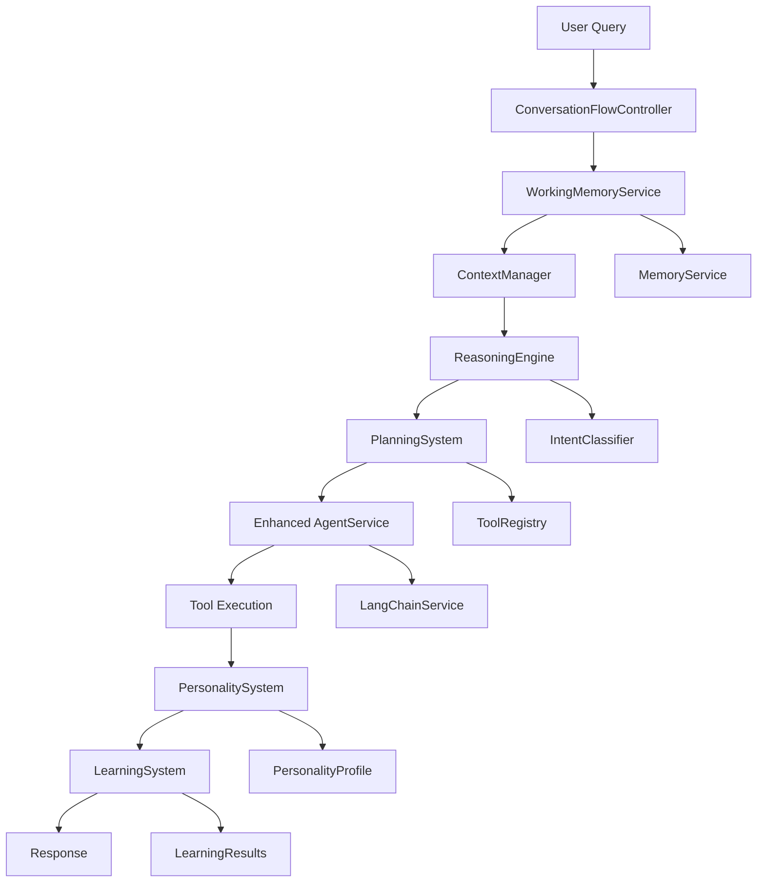
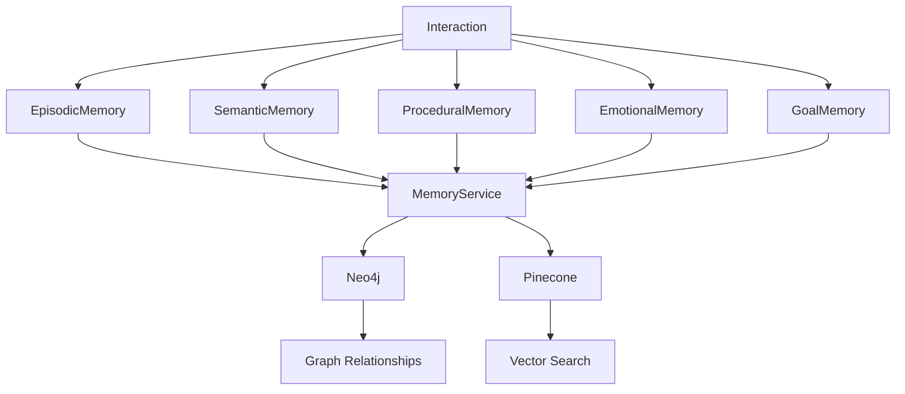

# 🏗️ AgentService v2.0 - Detailed Architecture

## 📋 Table of Contents
1. [System Overview](#system-overview)
2. [Core Components](#core-components)
3. [Memory Architecture](#memory-architecture)
4. [Conversation Flow](#conversation-flow)
5. [Reasoning Engine](#reasoning-engine)
6. [Planning System](#planning-system)
7. [Learning System](#learning-system)
8. [Context Management](#context-management)
9. [Personality System](#personality-system)
10. [API Design](#api-design)
11. [Data Flow](#data-flow)
12. [Performance Considerations](#performance-considerations)

## 🎯 System Overview

AgentService v2.0 builds upon the existing v1.0 architecture by adding intelligent layers that enhance conversation flow, reasoning capabilities, and learning mechanisms while maintaining full backward compatibility.

### **Architecture Principles**
- **Enhance, Don't Replace**: Build upon existing services
- **Backward Compatibility**: All v1.0 APIs remain functional
- **Modular Design**: New features can be enabled/disabled independently
- **Performance First**: Optimize for speed and efficiency
- **Intelligence Layered**: Add intelligence without breaking existing functionality

## 🧩 Core Components

### **1. Enhanced AgentService (Core Orchestrator)**

```typescript
export class AgentService {
  // ✅ Existing services (enhanced)
  private memoryService: MemoryService
  private intentClassifier: IntentClassifierService
  private langchainService: SimpleLangChainService
  private toolRegistry: AgentToolRegistry
  private relationshipAnalyzer: RelationshipAnalysisService
  private enhancedSemanticService: EnhancedSemanticService
  
  // 🆕 v2.0 enhancements
  private conversationFlowController: ConversationFlowController
  private reasoningEngine: ReasoningEngine
  private planningSystem: PlanningSystem
  private learningSystem: LearningSystem
  private contextManager: ContextManager
  private personalitySystem: PersonalitySystem
  private workingMemoryService: WorkingMemoryService
  
  // Enhanced executeQuery method
  async executeQuery(
    query: string,
    options: AgentExecutionOptions = {}
  ): Promise<EnhancedAgentExecutionResult> {
    // 1. Get working memory context
    const workingMemory = await this.workingMemoryService.getWorkingMemory(
      options.userId || 'default',
      options.sessionId || 'default'
    )
    
    // 2. Manage context window
    const managedContext = await this.contextManager.manageContext(
      workingMemory,
      query,
      options.maxTokens || 8000
    )
    
    // 3. Advanced reasoning
    const reasoning = await this.reasoningEngine.reason(
      query,
      managedContext.activeContext,
      this.toolRegistry.getAllTools()
    )
    
    // 4. Create execution plan
    const plan = await this.planningSystem.createExecutionPlan(
      query,
      reasoning.intent,
      managedContext.activeContext,
      reasoning
    )
    
    // 5. Execute with existing tool system (enhanced)
    const executionResult = await this.executeWithPlan(plan, options)
    
    // 6. Apply personality and learning
    const personalityResponse = await this.personalitySystem.generatePersonalityResponse(
      query,
      managedContext.activeContext,
      reasoning,
      executionResult.response
    )
    
    // 7. Learn from interaction
    await this.learningSystem.learnFromInteraction(
      { query, userId: options.userId, sessionId: options.sessionId },
      { success: executionResult.success, confidence: reasoning.confidence }
    )
    
    return {
      ...executionResult,
      response: personalityResponse.response,
      reasoning: reasoning,
      plan: plan,
      personality: personalityResponse,
      learning: await this.learningSystem.getLatestLearning()
    }
  }
}
```

### **2. Working Memory Service**

```typescript
export class WorkingMemoryService {
  private memoryService: MemoryService
  private contextManager: ContextManager
  
  async getWorkingMemory(
    userId: string,
    sessionId: string
  ): Promise<WorkingMemoryContext> {
    // 1. Get existing memory context
    const memoryContext = await this.memoryService.getMemoryContext(userId, sessionId)
    
    // 2. Build working memory
    return {
      conversationId: sessionId,
      currentTopic: await this.extractCurrentTopic(memoryContext),
      conversationState: await this.determineConversationState(memoryContext),
      activeGoals: await this.extractActiveGoals(memoryContext),
      contextWindow: await this.buildContextWindow(memoryContext),
      userProfile: await this.buildUserProfile(userId, memoryContext),
      sessionMetadata: await this.buildSessionMetadata(sessionId),
      lastInteraction: await this.getLastInteraction(memoryContext),
      conversationHistory: await this.getConversationHistory(memoryContext)
    }
  }
  
  private async extractCurrentTopic(memoryContext: MemoryContext): Promise<string> {
    // Analyze recent conversations to determine current topic
    const recentMemories = memoryContext.episodicMemories
      .slice(-5)
      .map(m => m.content)
      .join(' ')
    
    // Use LLM to extract topic
    const topicPrompt = `Extract the main topic from this conversation: ${recentMemories}`
    const response = await this.langchainService.complete(topicPrompt)
    return response.content
  }
  
  private async determineConversationState(memoryContext: MemoryContext): Promise<ConversationState> {
    // Analyze conversation patterns to determine state
    const patterns = await this.analyzeConversationPatterns(memoryContext)
    
    if (patterns.hasActiveGoal) return 'planning'
    if (patterns.awaitingResponse) return 'waiting'
    if (patterns.hasError) return 'error_recovery'
    if (patterns.isGreeting) return 'greeting'
    
    return 'active'
  }
}
```

## 🧠 Memory Architecture

### **Enhanced Memory Layers**

```typescript
export interface EnhancedMemorySystem {
  // ✅ Existing layers (enhanced)
  episodicMemory: EpisodicMemoryService
  semanticMemory: SemanticMemoryService
  
  // 🆕 New layers
  workingMemory: WorkingMemoryService
  proceduralMemory: ProceduralMemoryService
  emotionalMemory: EmotionalMemoryService
  goalMemory: GoalMemoryService
  personalityMemory: PersonalityMemoryService
}

export class ProceduralMemoryService {
  private memoryService: MemoryService
  
  async storeProcedure(
    procedure: Procedure,
    context: WorkingMemoryContext
  ): Promise<void> {
    // Store learned procedures and behaviors
    await this.memoryService.storeSemanticMemory({
      userId: context.userId,
      concept: `procedure_${procedure.id}`,
      description: procedure.description,
      metadata: {
        category: 'Procedure',
        confidence: procedure.confidence,
        source: 'procedural_learning',
        procedure_type: procedure.type,
        success_rate: procedure.successRate,
        last_used: new Date(),
        usage_count: 1
      },
      relationships: {
        similar: procedure.similarProcedures,
        parent: procedure.parentProcedure,
        children: procedure.subProcedures,
        related: procedure.relatedProcedures
      }
    })
  }
  
  async getRelevantProcedures(
    query: string,
    context: WorkingMemoryContext
  ): Promise<Procedure[]> {
    // Search for relevant procedures
    const searchResults = await this.memoryService.searchMemories({
      query,
      userId: context.userId,
      type: 'semantic',
      limit: 10
    })
    
    return searchResults.semantic.memories
      .filter(m => m.metadata.category === 'Procedure')
      .map(m => this.convertToProcedure(m))
  }
}

export class EmotionalMemoryService {
  private memoryService: MemoryService
  
  async trackEmotionalState(
    userId: string,
    sessionId: string,
    emotionalData: EmotionalData
  ): Promise<void> {
    // Track user emotional state and preferences
    await this.memoryService.storeEpisodicMemory({
      userId,
      sessionId,
      timestamp: new Date(),
      content: `Emotional state: ${emotionalData.state}, valence: ${emotionalData.valence}`,
      context: {
        emotional_tracking: true,
        state: emotionalData.state,
        valence: emotionalData.valence,
        arousal: emotionalData.arousal
      },
      metadata: {
        source: 'emotional_tracking',
        importance: 0.6,
        tags: ['emotion', emotionalData.state],
        emotional_data: emotionalData
      },
      relationships: {}
    })
  }
  
  async getEmotionalProfile(
    userId: string,
    sessionId: string
  ): Promise<EmotionalProfile> {
    // Build emotional profile from memory
    const memories = await this.memoryService.searchMemories({
      query: 'emotional state',
      userId,
      type: 'episodic',
      limit: 50
    })
    
    return this.buildEmotionalProfile(memories.episodic.memories)
  }
}
```

## 💬 Conversation Flow

### **Conversation Flow Controller**

```typescript
export class ConversationFlowController {
  private agentService: AgentService
  private conversationState: Map<string, ConversationState>
  private goalTracker: GoalTracker
  
  async processMessage(
    userId: string,
    sessionId: string,
    message: string,
    options: AgentExecutionOptions = {}
  ): Promise<ConversationResponse> {
    // 1. Update conversation state
    const state = await this.updateConversationState(userId, sessionId, message)
    
    // 2. Check for goal changes
    const goalChanges = await this.goalTracker.analyzeGoalChanges(message, state)
    
    // 3. Determine response strategy
    const strategy = await this.determineResponseStrategy(message, state, goalChanges)
    
    // 4. Execute with enhanced agent service
    const result = await this.agentService.executeQuery(message, {
      ...options,
      userId,
      sessionId,
      conversationContext: state,
      responseStrategy: strategy
    })
    
    // 5. Update conversation state
    await this.updateConversationState(userId, sessionId, message, result)
    
    return {
      response: result.response,
      conversationState: state,
      goalChanges,
      strategy,
      metadata: result.metadata
    }
  }
  
  private async determineResponseStrategy(
    message: string,
    state: ConversationState,
    goalChanges: GoalChange[]
  ): Promise<ResponseStrategy> {
    // Analyze message and state to determine response strategy
    if (goalChanges.length > 0) {
      return 'goal_oriented'
    }
    
    if (state.conversationState === 'planning') {
      return 'planning_focused'
    }
    
    if (state.conversationState === 'error_recovery') {
      return 'error_recovery'
    }
    
    if (this.isGreeting(message)) {
      return 'greeting'
    }
    
    if (this.isQuestion(message)) {
      return 'question_answering'
    }
    
    return 'conversational'
  }
}
```

## 🧠 Reasoning Engine

### **Advanced Reasoning System**

```typescript
export class ReasoningEngine {
  private intentClassifier: IntentClassifierService
  private langchainService: SimpleLangChainService
  private memoryService: MemoryService
  
  async reason(
    query: string,
    context: WorkingMemoryContext,
    availableTools: Tool[]
  ): Promise<ReasoningResult> {
    // 1. Intent classification (existing)
    const intent = await this.intentClassifier.classifyQuery(query, {
      memoryContext: context,
      includeAvailableTools: true
    })
    
    // 2. Chain of thought reasoning
    const thoughtProcess = await this.chainOfThoughtReasoning(query, context)
    
    // 3. Logical inference
    const logicalConclusions = await this.logicalInference(query, context, thoughtProcess)
    
    // 4. Causal analysis
    const causalAnalysis = await this.causalReasoning(query, context, thoughtProcess)
    
    // 5. Analogical reasoning
    const analogies = await this.analogicalReasoning(query, context)
    
    // 6. Tool reasoning
    const toolReasoning = await this.toolReasoning(query, context, availableTools)
    
    return {
      intent,
      thoughtProcess,
      logicalConclusions,
      causalAnalysis,
      analogies,
      toolReasoning,
      confidence: this.calculateOverallConfidence(
        intent,
        thoughtProcess,
        logicalConclusions,
        causalAnalysis
      )
    }
  }
  
  private async chainOfThoughtReasoning(
    query: string,
    context: WorkingMemoryContext
  ): Promise<ThoughtProcess> {
    const prompt = `
    Analyze this query step by step:
    Query: "${query}"
    Context: ${JSON.stringify(context, null, 2)}
    
    Provide a step-by-step reasoning process:
    1. What is the user asking for?
    2. What information do I need to answer this?
    3. What are the key considerations?
    4. What are potential approaches?
    5. What are the risks or limitations?
    
    Format as JSON with steps array.
    `
    
    const response = await this.langchainService.complete(prompt, {
      model: 'openai',
      temperature: 0.3
    })
    
    return JSON.parse(response.content)
  }
  
  private async logicalInference(
    query: string,
    context: WorkingMemoryContext,
    thoughtProcess: ThoughtProcess
  ): Promise<LogicalConclusion[]> {
    const prompt = `
    Based on this reasoning process, what logical conclusions can be drawn?
    
    Query: "${query}"
    Thought Process: ${JSON.stringify(thoughtProcess, null, 2)}
    Context: ${JSON.stringify(context, null, 2)}
    
    Provide logical conclusions with confidence scores.
    `
    
    const response = await this.langchainService.complete(prompt, {
      model: 'openai',
      temperature: 0.2
    })
    
    return JSON.parse(response.content)
  }
}
```

## 📋 Planning System

### **Hierarchical Planning**

```typescript
export class PlanningSystem {
  private toolRegistry: AgentToolRegistry
  private langchainService: SimpleLangChainService
  private memoryService: MemoryService
  
  async createExecutionPlan(
    query: string,
    intent: QueryIntent,
    context: WorkingMemoryContext,
    reasoning: ReasoningResult
  ): Promise<ExecutionPlan> {
    // 1. Extract goals
    const goals = await this.extractGoals(query, context, reasoning)
    
    // 2. Decompose goals
    const subgoals = await this.decomposeGoals(goals, context)
    
    // 3. Plan actions
    const actions = await this.planActions(subgoals, intent, context)
    
    // 4. Allocate resources
    const resourceAllocation = await this.allocateResources(actions, context)
    
    // 5. Create timeline
    const timeline = await this.createTimeline(actions, resourceAllocation)
    
    // 6. Generate fallback strategies
    const fallbackStrategies = await this.generateFallbackStrategies(actions, context)
    
    return {
      originalQuery: query,
      intent,
      goals,
      subgoals,
      actions,
      resourceAllocation,
      timeline,
      fallbackStrategies,
      estimatedDuration: timeline.totalDuration,
      successProbability: this.calculateSuccessProbability(actions, context),
      riskAssessment: await this.assessRisks(actions, context)
    }
  }
  
  private async extractGoals(
    query: string,
    context: WorkingMemoryContext,
    reasoning: ReasoningResult
  ): Promise<Goal[]> {
    const prompt = `
    Extract goals from this query and context:
    
    Query: "${query}"
    Context: ${JSON.stringify(context, null, 2)}
    Reasoning: ${JSON.stringify(reasoning, null, 2)}
    
    Identify both explicit and implicit goals.
    Format as JSON array of goals with priority, description, and success criteria.
    `
    
    const response = await this.langchainService.complete(prompt, {
      model: 'openai',
      temperature: 0.3
    })
    
    return JSON.parse(response.content)
  }
  
  private async planActions(
    subgoals: Goal[],
    intent: QueryIntent,
    context: WorkingMemoryContext
  ): Promise<Action[]> {
    const availableTools = this.toolRegistry.getAllTools()
    
    const prompt = `
    Plan actions to achieve these subgoals:
    
    Subgoals: ${JSON.stringify(subgoals, null, 2)}
    Intent: ${JSON.stringify(intent, null, 2)}
    Available Tools: ${JSON.stringify(availableTools, null, 2)}
    Context: ${JSON.stringify(context, null, 2)}
    
    Create a sequence of actions with:
    - Tool selection
    - Parameter extraction
    - Dependencies
    - Success criteria
    - Error handling
    
    Format as JSON array of actions.
    `
    
    const response = await this.langchainService.complete(prompt, {
      model: 'openai',
      temperature: 0.2
    })
    
    return JSON.parse(response.content)
  }
}
```

## 🎓 Learning System

### **Continuous Learning**

```typescript
export class LearningSystem {
  private memoryService: MemoryService
  private relationshipAnalyzer: RelationshipAnalysisService
  private enhancedSemanticService: EnhancedSemanticService
  
  async learnFromInteraction(
    interaction: Interaction,
    outcome: InteractionOutcome
  ): Promise<LearningResult> {
    // 1. Analyze interaction patterns
    const patterns = await this.analyzeInteractionPatterns(interaction, outcome)
    
    // 2. Extract learning insights
    const insights = await this.extractLearningInsights(patterns)
    
    // 3. Update behaviors
    const behaviorUpdates = await this.updateBehaviors(insights)
    
    // 4. Synthesize knowledge
    const knowledge = await this.synthesizeKnowledge(insights, behaviorUpdates)
    
    // 5. Store learning results
    await this.storeLearningResults(interaction, outcome, patterns, insights, behaviorUpdates, knowledge)
    
    return {
      patterns,
      insights,
      behaviorUpdates,
      knowledge,
      learningConfidence: this.calculateLearningConfidence(patterns, insights)
    }
  }
  
  private async analyzeInteractionPatterns(
    interaction: Interaction,
    outcome: InteractionOutcome
  ): Promise<Pattern[]> {
    // Analyze patterns in successful vs failed interactions
    const prompt = `
    Analyze patterns in this interaction:
    
    Interaction: ${JSON.stringify(interaction, null, 2)}
    Outcome: ${JSON.stringify(outcome, null, 2)}
    
    Identify:
    1. Success patterns
    2. Failure patterns
    3. Context patterns
    4. Tool usage patterns
    5. Response patterns
    
    Format as JSON array of patterns.
    `
    
    const response = await this.langchainService.complete(prompt, {
      model: 'openai',
      temperature: 0.3
    })
    
    return JSON.parse(response.content)
  }
  
  private async updateBehaviors(insights: LearningInsight[]): Promise<BehaviorUpdate[]> {
    // Update agent behaviors based on learning insights
    const updates: BehaviorUpdate[] = []
    
    for (const insight of insights) {
      if (insight.type === 'success_pattern') {
        updates.push({
          type: 'reinforce',
          behavior: insight.behavior,
          confidence: insight.confidence,
          action: 'increase_usage'
        })
      } else if (insight.type === 'failure_pattern') {
        updates.push({
          type: 'modify',
          behavior: insight.behavior,
          confidence: insight.confidence,
          action: 'decrease_usage'
        })
      }
    }
    
    return updates
  }
}
```

## 🎭 Personality System

### **Consistent Personality**

```typescript
export class PersonalitySystem {
  private langchainService: SimpleLangChainService
  private memoryService: MemoryService
  
  async generatePersonalityResponse(
    query: string,
    context: WorkingMemoryContext,
    reasoning: ReasoningResult,
    baseResponse: string
  ): Promise<PersonalityResponse> {
    // 1. Get personality profile
    const personalityProfile = await this.getPersonalityProfile(context)
    
    // 2. Apply personality traits
    const personalityContext = await this.applyPersonalityTraits(
      query,
      context,
      personalityProfile
    )
    
    // 3. Style response
    const styledResponse = await this.styleResponse(
      baseResponse,
      personalityContext,
      reasoning
    )
    
    // 4. Check consistency
    const consistency = await this.checkConsistency(styledResponse, context)
    
    // 5. Apply emotional intelligence
    const emotionalResponse = await this.applyEmotionalIntelligence(
      styledResponse,
      context,
      personalityProfile
    )
    
    return {
      response: emotionalResponse,
      personalityTraits: personalityProfile.activeTraits,
      consistencyScore: consistency.score,
      styleConfidence: this.calculateStyleConfidence(emotionalResponse),
      emotionalTone: this.extractEmotionalTone(emotionalResponse)
    }
  }
  
  private async getPersonalityProfile(
    context: WorkingMemoryContext
  ): Promise<PersonalityProfile> {
    // Build personality profile from memory and context
    const memories = await this.memoryService.searchMemories({
      query: 'personality traits preferences',
      userId: context.userId,
      type: 'semantic',
      limit: 20
    })
    
    return this.buildPersonalityProfile(memories.semantic.memories, context)
  }
  
  private async styleResponse(
    baseResponse: string,
    personalityContext: PersonalityContext,
    reasoning: ReasoningResult
  ): Promise<string> {
    const prompt = `
    Style this response according to the personality profile:
    
    Base Response: "${baseResponse}"
    Personality Context: ${JSON.stringify(personalityContext, null, 2)}
    Reasoning: ${JSON.stringify(reasoning, null, 2)}
    
    Apply personality traits while maintaining:
    - Accuracy
    - Helpfulness
    - Professionalism
    - Consistency
    
    Return the styled response.
    `
    
    const response = await this.langchainService.complete(prompt, {
      model: 'openai',
      temperature: 0.7
    })
    
    return response.content
  }
}
```

## 🔄 Data Flow

### **Complete Request Flow**



### **Memory Flow**



## ⚡ Performance Considerations

### **Optimization Strategies**

1. **Memory Optimization**
   - Lazy loading of memory contexts
   - Intelligent caching of frequently accessed memories
   - Compression of old memories

2. **Reasoning Optimization**
   - Parallel execution of reasoning tasks
   - Caching of reasoning results
   - Early termination for simple queries

3. **Context Management**
   - Smart context compression
   - Relevance-based filtering
   - Token budget management

4. **Learning Optimization**
   - Batch learning updates
   - Incremental learning
   - Pattern caching

### **Performance Metrics**

- **Response Time**: < 3 seconds for complex queries
- **Memory Usage**: < 100MB per session
- **Context Window**: 8K tokens maximum
- **Learning Rate**: 1-2 patterns per interaction
- **Consistency Score**: > 0.8

---

This architecture provides a solid foundation for building a ChatGPT-level intelligent agent while maintaining the strengths of the existing system.
