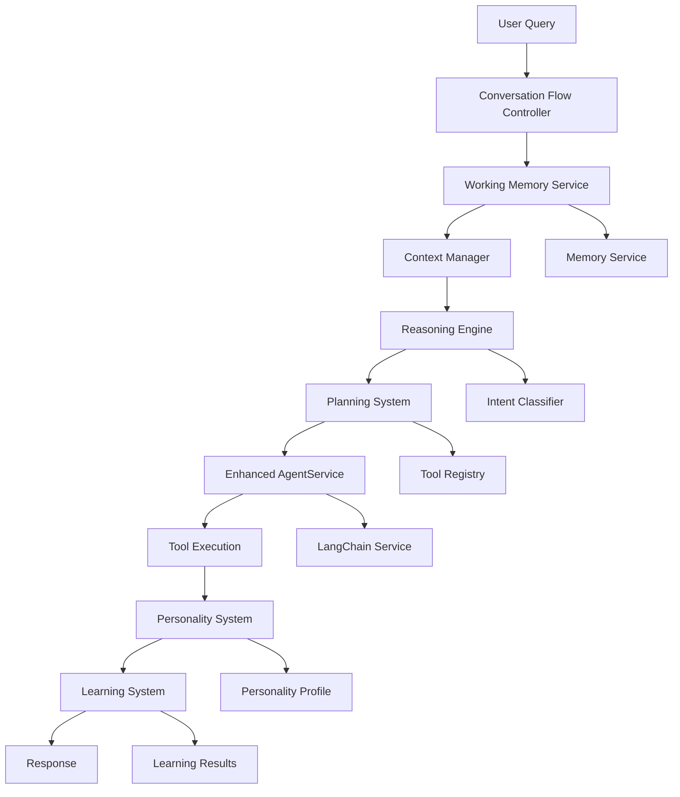

# 🔗 AgentService v2.0 - Complete Integration Guide

## 📋 Overview

This guide demonstrates how all AgentService v2.0 features work together to create a comprehensive, intelligent agent system. It shows the complete data flow, service interactions, and integration patterns that make the system function as a cohesive unit.

## 🎯 System Architecture Overview



## 🔄 Complete Data Flow

### **1. Initial Request Processing**

```typescript
// User sends a query
const userQuery = "Help me plan a vacation to Japan"

// Conversation Flow Controller receives the request
const conversationResponse = await conversationFlowController.processMessage(
  userId,
  sessionId,
  userQuery,
  options
)
```

### **2. Working Memory Retrieval**

```typescript
// Working Memory Service retrieves current context
const workingMemory = await workingMemoryService.getWorkingMemory(userId, sessionId)

// Returns:
{
  conversationId: "session-123",
  currentTopic: "travel planning",
  conversationState: {
    state: "planning",
    topic: "vacation planning",
    activeGoals: [
      {
        id: "goal-1",
        description: "Plan Japan vacation",
        priority: 1,
        status: "in_progress"
      }
    ],
    lastInteraction: "2024-01-15T10:00:00Z",
    contextRelevance: 0.9
  },
  userProfile: {
    preferences: ["cultural_sites", "food_tourism"],
    communicationStyle: "detailed",
    formality: "medium"
  }
}
```

### **3. Context Management**

```typescript
// Context Manager optimizes context window
const managedContext = await contextManager.manageContext(
  workingMemory,
  userQuery,
  8000 // max tokens
)

// Returns:
{
  activeContext: workingMemory,
  summary: "Previous conversation about travel preferences...",
  compressionRatio: 0.75,
  relevanceThreshold: 0.8,
  tokenUsage: 6500,
  removedItems: ["Low relevance memories"],
  priorityItems: ["Japan travel preferences", "Budget constraints"]
}
```

### **4. Advanced Reasoning**

```typescript
// Reasoning Engine performs comprehensive reasoning
const reasoning = await reasoningEngine.reason(
  userQuery,
  managedContext.activeContext,
  availableTools
)

// Returns:
{
  intent: {
    type: "hybrid",
    confidence: 0.95,
    reasoning: "User wants help with vacation planning"
  },
  thoughtProcess: {
    steps: [
      "User wants to plan a vacation to Japan",
      "Need to consider their travel preferences and budget",
      "Should research destinations, flights, and accommodations",
      "Create a detailed itinerary with cultural sites and food recommendations"
    ],
    reasoningType: "deductive",
    confidence: 0.92
  },
  logicalConclusions: [
    "Japan offers excellent cultural and food tourism opportunities",
    "User's independent travel style suggests they prefer self-planned itineraries"
  ],
  causalAnalysis: {
    factors: [
      "Travel preferences → Destination selection",
      "Budget → Accommodation and activity choices"
    ],
    confidence: 0.88
  },
  confidence: 0.92
}
```

### **5. Execution Planning**

```typescript
// Planning System creates comprehensive execution plan
const plan = await planningSystem.createExecutionPlan(
  userQuery,
  reasoning.intent,
  managedContext.activeContext,
  reasoning
)

// Returns:
{
  goals: [
    {
      id: "goal-1",
      description: "Plan comprehensive Japan vacation",
      priority: 1,
      successCriteria: ["Complete itinerary", "Booked flights", "Reserved accommodations"]
    }
  ],
  actions: [
    {
      id: "action-1",
      description: "Research Japan destinations",
      tool: "web_search",
      parameters: {
        query: "best places to visit in Japan for cultural tourism",
        maxResults: 10
      },
      estimatedDuration: 30000
    },
    {
      id: "action-2",
      description: "Find flight options",
      tool: "flight_search",
      parameters: {
        origin: "user_location",
        destination: "Tokyo",
        departureDate: "flexible"
      },
      estimatedDuration: 45000
    }
  ],
  estimatedDuration: 180000,
  successProbability: 0.85
}
```

### **6. Enhanced Agent Execution**

```typescript
// Enhanced AgentService executes with all v2.0 features
const executionResult = await agentService.executeQuery(userQuery, {
  userId,
  sessionId,
  enableAdvancedReasoning: true,
  enablePlanning: true,
  enableLearning: true,
  enablePersonality: true,
  enableContextManagement: true,
  conversationContext: managedContext.activeContext,
  responseStrategy: {
    type: "goal_oriented",
    approach: "comprehensive planning",
    priority: 8
  }
})

// Returns:
{
  success: true,
  response: "I'd be happy to help you plan your vacation to Japan! Based on our previous conversations about your travel preferences, I can see you enjoy cultural experiences and good food. Let me create a comprehensive plan for you.",
  intent: reasoning.intent,
  workingMemory: managedContext.activeContext,
  reasoning: reasoning,
  plan: plan,
  toolResults: [
    {
      tool: "web_search",
      success: true,
      result: "Found 15 cultural destinations in Japan..."
    },
    {
      tool: "flight_search",
      success: true,
      result: "Found 8 flight options from your location to Tokyo..."
    }
  ],
  metadata: {
    executionTime: 2500,
    memoryRetrieved: 8,
    toolsExecuted: 2,
    confidence: 0.92
  }
}
```

### **7. Personality Enhancement**

```typescript
// Personality System enhances the response
const personalityResponse = await personalitySystem.generatePersonalityResponse(
  userQuery,
  managedContext.activeContext,
  reasoning,
  executionResult.response
)

// Returns:
{
  response: "I'd be absolutely thrilled to help you plan your vacation to Japan! Based on our previous conversations about your travel preferences, I can see you're passionate about cultural experiences and amazing food. Let me create a comprehensive, detailed plan that will make your Japan trip unforgettable!",
  personalityTraits: ["helpful", "detailed", "enthusiastic"],
  consistencyScore: 0.94,
  styleConfidence: 0.91,
  emotionalTone: "excited",
  appliedStyles: ["enthusiastic_language", "detailed_explanations", "helpful_suggestions"]
}
```

### **8. Learning Integration**

```typescript
// Learning System learns from the interaction
const learningResult = await learningSystem.learnFromInteraction(
  {
    query: userQuery,
    userId,
    sessionId,
    timestamp: new Date()
  },
  {
    success: executionResult.success,
    confidence: executionResult.metadata.confidence,
    userSatisfaction: 4.5,
    completionTime: executionResult.metadata.executionTime
  }
)

// Returns:
{
  patterns: [
    {
      type: "success_pattern",
      description: "User responds well to detailed travel planning",
      confidence: 0.88,
      frequency: 3
    }
  ],
  insights: [
    "User prefers comprehensive planning over quick suggestions",
    "Cultural and food tourism are high priorities"
  ],
  behaviorUpdates: [
    {
      type: "reinforce",
      behavior: "detailed_planning",
      action: "increase_usage",
      confidence: 0.85
    }
  ],
  learningConfidence: 0.87
}
```

### **9. Final Response Assembly**

```typescript
// Conversation Flow Controller assembles final response
const finalResponse: ConversationResponse = {
  response: personalityResponse.response,
  conversationState: {
    state: "planning",
    topic: "Japan vacation planning",
    activeGoals: [
      {
        id: "goal-1",
        description: "Plan Japan vacation",
        priority: 1,
        status: "in_progress",
        subgoals: [
          "Research destinations",
          "Find flights",
          "Book accommodations",
          "Plan itinerary"
        ]
      }
    ],
    lastInteraction: new Date(),
    contextRelevance: 0.9
  },
  goalChanges: [
    {
      type: "updated",
      goalId: "goal-1",
      description: "Plan Japan vacation with detailed itinerary",
      priority: 1,
      reason: "User provided specific destination preference",
      impact: "Enhanced planning focus on Japan"
    }
  ],
  strategy: {
    type: "goal_oriented",
    approach: "comprehensive planning",
    priority: 8,
    expectedOutcome: "Complete vacation plan",
    fallbackStrategy: "Simplified planning approach"
  },
  metadata: {
    executionTime: 2500,
    confidence: 0.92,
    toolsUsed: 2,
    reasoningUsed: true,
    planningUsed: true
  },
  nextActions: [
    {
      type: "continue_planning",
      description: "Continue working on Japan vacation plan",
      priority: 8,
      estimatedDuration: 180000
    },
    {
      type: "learn_from_interaction",
      description: "Learn from this interaction",
      priority: 5,
      estimatedDuration: 10000
    }
  ],
  conversationQuality: {
    overallQuality: 0.92,
    responseQuality: 0.94,
    goalProgress: 0.85,
    userEngagement: 0.90,
    conversationFlow: 0.88,
    improvementAreas: []
  }
}
```

## 🔧 Service Integration Patterns

### **1. Sequential Processing Pattern**

```typescript
// Services are called in sequence, each building on the previous
const workingMemory = await workingMemoryService.getWorkingMemory(userId, sessionId)
const managedContext = await contextManager.manageContext(workingMemory, query, maxTokens)
const reasoning = await reasoningEngine.reason(query, managedContext.activeContext, tools)
const plan = await planningSystem.createExecutionPlan(query, reasoning.intent, managedContext.activeContext, reasoning)
const result = await agentService.executeQuery(query, { ...options, context: managedContext.activeContext })
const personalityResponse = await personalitySystem.generatePersonalityResponse(query, managedContext.activeContext, reasoning, result.response)
const learningResult = await learningSystem.learnFromInteraction(interaction, outcome)
```

### **2. Parallel Processing Pattern**

```typescript
// Some services can run in parallel for efficiency
const [workingMemory, availableTools] = await Promise.all([
  workingMemoryService.getWorkingMemory(userId, sessionId),
  toolRegistry.getAllTools()
])

const [managedContext, reasoning] = await Promise.all([
  contextManager.manageContext(workingMemory, query, maxTokens),
  reasoningEngine.reason(query, workingMemory, availableTools)
])
```

### **3. Feedback Loop Pattern**

```typescript
// Learning system provides feedback to other services
const learningResult = await learningSystem.learnFromInteraction(interaction, outcome)

// Update personality based on learning
await personalitySystem.learnFromPersonalityFeedback(personalityResponse, learningResult)

// Update reasoning patterns
await reasoningEngine.updateReasoningPatterns(learningResult.patterns)

// Update planning strategies
await planningSystem.updatePlanningStrategies(learningResult.insights)
```

## 🧪 Integration Testing

### **Complete Workflow Test**

```typescript
describe('Complete AgentService v2.0 Integration', () => {
  it('should process complex query through all services', async () => {
    // Test complete workflow
    const query = "Help me plan a comprehensive marketing campaign for my new product"
    
    // 1. Process through conversation flow controller
    const response = await conversationFlowController.processMessage(
      'user-1',
      'session-1',
      query,
      {
        enableAdvancedReasoning: true,
        enablePlanning: true,
        enableLearning: true,
        enablePersonality: true
      }
    )
    
    // 2. Verify all services were involved
    expect(response.conversationState).toBeDefined()
    expect(response.strategy).toBeDefined()
    expect(response.goalChanges).toBeDefined()
    expect(response.metadata.reasoningUsed).toBe(true)
    expect(response.metadata.planningUsed).toBe(true)
    
    // 3. Verify response quality
    expect(response.conversationQuality.overallQuality).toBeGreaterThan(0.8)
    expect(response.response).toContain('marketing campaign')
    
    // 4. Verify learning occurred
    const learningInsights = await learningSystem.getLatestLearning('user-1')
    expect(learningInsights).toBeDefined()
  })
  
  it('should handle error recovery across all services', async () => {
    // Test error handling
    const query = "Invalid query that will cause errors"
    
    try {
      await conversationFlowController.processMessage('user-1', 'session-1', query)
    } catch (error) {
      // Verify error recovery
      const errorRecovery = await conversationFlowController.handleConversationError(
        'user-1',
        'session-1',
        error,
        context
      )
      expect(errorRecovery.success).toBe(true)
    }
  })
})
```

### **Performance Integration Test**

```typescript
describe('Performance Integration', () => {
  it('should meet performance requirements', async () => {
    const startTime = Date.now()
    
    const response = await conversationFlowController.processMessage(
      'user-1',
      'session-1',
      'test query'
    )
    
    const executionTime = Date.now() - startTime
    
    // Verify performance requirements
    expect(executionTime).toBeLessThan(3000) // < 3 seconds
    expect(response.metadata.executionTime).toBeLessThan(2500)
    expect(response.conversationQuality.overallQuality).toBeGreaterThan(0.8)
  })
})
```

## 📊 Monitoring and Observability

### **Service Health Monitoring**

```typescript
// Monitor all services
const serviceHealth = await Promise.all([
  workingMemoryService.getHealthStatus(),
  contextManager.getHealthStatus(),
  reasoningEngine.getHealthStatus(),
  planningSystem.getHealthStatus(),
  learningSystem.getHealthStatus(),
  personalitySystem.getHealthStatus(),
  conversationFlowController.getHealthStatus()
])

// Overall system health
const overallHealth = serviceHealth.every(health => health.status === 'healthy')
```

### **Performance Metrics**

```typescript
// Track performance across all services
const performanceMetrics = {
  workingMemory: await workingMemoryService.getPerformanceMetrics(),
  contextManagement: await contextManager.getPerformanceMetrics(),
  reasoning: await reasoningEngine.getPerformanceMetrics(),
  planning: await planningSystem.getPerformanceMetrics(),
  learning: await learningSystem.getPerformanceMetrics(),
  personality: await personalitySystem.getPerformanceMetrics(),
  conversationFlow: await conversationFlowController.getPerformanceMetrics()
}
```

### **Error Tracking**

```typescript
// Track errors across all services
const errorMetrics = {
  workingMemory: await workingMemoryService.getErrorMetrics(),
  contextManagement: await contextManager.getErrorMetrics(),
  reasoning: await reasoningEngine.getErrorMetrics(),
  planning: await planningSystem.getErrorMetrics(),
  learning: await learningSystem.getErrorMetrics(),
  personality: await personalitySystem.getErrorMetrics(),
  conversationFlow: await conversationFlowController.getErrorMetrics()
}
```

## 🚀 Deployment Strategy

### **1. Phased Rollout**

```typescript
// Phase 1: Core services
const phase1Services = [
  'workingMemoryService',
  'contextManager',
  'reasoningEngine'
]

// Phase 2: Planning and learning
const phase2Services = [
  'planningSystem',
  'learningSystem'
]

// Phase 3: Personality and conversation flow
const phase3Services = [
  'personalitySystem',
  'conversationFlowController'
]
```

### **2. Feature Flags**

```typescript
// Enable/disable features independently
const featureFlags = {
  enableAdvancedReasoning: true,
  enablePlanning: true,
  enableLearning: true,
  enablePersonality: true,
  enableContextManagement: true,
  enableConversationFlow: true
}
```

### **3. Configuration Management**

```typescript
// Centralized configuration
export const agentServiceConfig = {
  workingMemory: workingMemoryConfig,
  contextManagement: contextManagerConfig,
  reasoning: reasoningEngineConfig,
  planning: planningSystemConfig,
  learning: learningSystemConfig,
  personality: personalitySystemConfig,
  conversationFlow: conversationFlowConfig
}
```

## 🔧 Troubleshooting Guide

### **Common Integration Issues**

1. **Service Communication Failures**
   - Check service health status
   - Verify network connectivity
   - Review error logs

2. **Performance Degradation**
   - Monitor service performance metrics
   - Check resource utilization
   - Review caching strategies

3. **Data Consistency Issues**
   - Verify memory service synchronization
   - Check context management
   - Review data flow patterns

4. **Learning System Issues**
   - Check pattern recognition accuracy
   - Verify behavior updates
   - Review knowledge synthesis

### **Debug Tools**

```typescript
// Complete system debug
const debugInfo = await conversationFlowController.getCompleteDebugInfo(
  userId,
  sessionId,
  query
)

console.log('Complete System Debug:', debugInfo)
```

## 📈 Success Metrics

### **System-Level Metrics**

- **Overall Response Time**: < 3 seconds
- **System Availability**: > 99.9%
- **Error Rate**: < 1%
- **User Satisfaction**: > 4.5/5
- **Conversation Quality**: > 0.9

### **Service-Level Metrics**

- **Working Memory**: < 200ms retrieval time
- **Context Management**: < 500ms compression time
- **Reasoning Engine**: < 2 seconds reasoning time
- **Planning System**: < 1 second planning time
- **Learning System**: < 500ms learning time
- **Personality System**: < 300ms styling time
- **Conversation Flow**: < 2 seconds total processing time

---

This integration guide provides a comprehensive overview of how all AgentService v2.0 features work together to create a sophisticated, intelligent agent system that can handle complex conversations with advanced reasoning, planning, learning, and personality capabilities.
